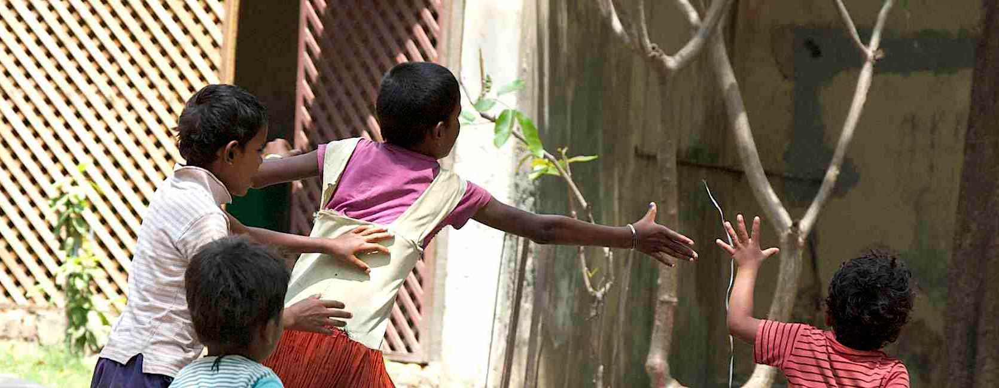

A five year old girl with bare feet, cracked lips and a dusty once-pink dress begs at your feet with her hand outstretched. You remember your own daughter at this age wearing such a dress to a party where food was wasted and expensive gifts exchanged. But this little girl is filthy and is pleading with you.

Though she is mostly speaking in Hindi she knows just the right English words to try and break your heart. Her insistent repetition for "just ten rupees" echoes through you and the desperate tone in her voice as she says "please" tears through your irresolute but nonetheless guilty conscience. When you do the maths you realise she is only asking for fifteen pence.

People are watching now, the drink stand workers, the rickshaw drivers and the other tourists who are mostly Indian. It's hard to tell this little girl to go away but also hard to ignore her. You could just give in and she would have her bounty and go away taking you out of what now feels like an awkward situation and a moral dilemma.

The dilemma arises because the advice is not to give. You have been told that opening your wallet simply encourages the problem keeping the hope of creating a living on the streets alive. This is difficult to accept when you know your pockets are filled with the potential to change the day, the week or even the life of the child before you. Or so it feels. You are told that in most circumstances the child is not operating alone, but as part of some Dickensian style street gang where the Fagin character will simply take the rewards from the child and keep them loyal yet down-trodden.

{.img-screenshot}

And so you are left feeling like a stone-hearted bastard. A rich, overfed, selfish, self-satisfied Westerner whose ancestors ripped marble from the tombs of India to decorate their own palaces. You feel like nothing more than a continuation of this exploitative past, no better and no more helpful.
You recall the information being given by the authorities. You look again, this tiny girl has very good teeth. She is also far from being starved. Is she simply being used to manipulate passing tourists - a prized weapon in Fagin's army of urchins?

A policeman has spotted the girl, grabs her arm and begins to march her away. Towering over this tiny child, you see he holds a stick. You consider what he will do. Take her around the corner and beat her? You have to assume not, as she didn't look like a victim of violence. Yet she grabs desperately at the clothing of other tourists as she is dragged away, crying and pleading. Is this part of a show repeated daily or hourly? You can't know and never will for sure but it is etched into longterm memory. That much you know.

And so you question yourself and your place in the universe. A daily existence of work that on a planetary scale is utterly fatuous. Discussing design elements, the wrong shade of green, a font that is too 'edgy' or an image that has the wrong 'feel', a web page that doesn't have enough 'energy' or that feels 'disjointed'. Painful, agonising discussions over nothing. So much time, energy and money put into what is nothing more than an ephemeral sigh into the winds of a forgotten tomorrow. It all seems as pointless and heart breaking as the pleading, genuine or not, of the girl in the pink dress.

You didn't expect to be affected by India. But she has touched you. The tourist board has come up with the slogan 'Incredible India!' and it truly hits home. You are left in incredulity at the chaos, the extremes of wealth, and the deep seated spirituality of the people for whom it is either a fundamental support system as they struggle for existence or mere garnish on top of their brand new BMW. You are incredulous of the roads, the heat, the dirt and the colour. How is it possible for a place to be so desperate yet so inspiring. How can a family with babies and toddlers live by the side of the road only inches from a wild throng of traffic and potential calamity. How can a person live a happy life in which you need to step over a naked baby laying on the pavement to reach the bank. How can the wealthy live here alongside such human misery every day of their more fortunate lives. How do the poor survive and find the energy to exist in the desperation and fiery hell of the city.

Yes, after only a short stay in one tiny corner of this vast and diverse country I see it now. India is incredible. Truly incredible.
