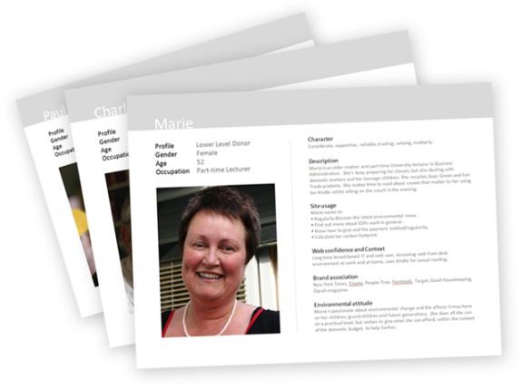

Recently I was asked recently to prepare a set of user personas for a large new client website. As a newcomer to the wonderful world of 'User Experience' design,this was an interesting challenge and I thought I would share my findings with the lovely people in the land of Boag.

===

### What is a user persona?

So what on Earth IS a persona? Well, a web persona is a stereotype, or archetype of a typical website user.  For getting to grips with the theory, we've covered Personas before on Boagworld; see [this previous post on the subject.](http://boagworld.com/site-content/site-personas/)

### Personas are useful.

In discussions of site architecture and design, it is far easier and more natural to ask; 'what would George do',  or 'how would Sharon use this feature' rather than talking in abstract or vague terms throughout. Personas help to pin things down and put the user into the process of designing a site and managing it over the longer term.

### Identifying your audience

I was lucky in this instance to be given a list of users requiring web personas. Stakeholder interviews were held at the client’s premises, and different users of the site identified by talking with those directly involved with the day-to-day running of the organisation. Talking to the client and identifying their needs is a fast and effective way of really getting to the bottom of classifying the target audience. In my project there could have been as many as twelve different identifiable main user categories, but we pinned it down to the eight most diverse and important.

### What should your persona consist of?

I decided on the following information for my personas:

  * **Name**
  * **Profile type**
  * **Age**
  * **Gender**
  * **Occupation**
  * **Character**
  * **Description**
  * **Site usage** - this is a short list of the tasks or objectives the user wants to achieve using the website, however general or detailed.  These types of use cases are probably the most useful aspect of any persona.
  * **Web confidence and context **- this is the experience and knowledge they have of IT and the web, and the circumstances they will  use the site under. This is a good chance to highlight the kind of devices they may be using, or any possible accessibility issues.
  * **Brands they identify with** - this provides a few brands that may be relevant to the person being portrayed. We have strong ideas  about people who drive particular cars or buy particular products, and eat from certain places. This  is another way of generalising about a particular type of person. This, as I discovered, is not quite so easy if you are creating personas for users in another country where brand association may not be quite so identifiable.
  * **Good strong photograph** -  to really visualise and distinguish the personas from each other.

### Coming up with the information

Well, this is the tricky bit. I now know that to write web personas it takes understanding, experience of people, a lot of research, and quite a bit of imagination.

For some of my personas, I Googled job adverts or individuals I thought may be similar and created their life details. For others I drew upon stereotypical images of people we know from real life, TV, novels, media or film, whilst trying to keep them realistic and not simple caricatures.

Finding the right photograph was really useful in imagining a life, and inspired further assumptions from the way they looked; imagining the type of brands they may aspire to. Of course, they also have to look the right age and, sometimes, nationality. We have an inherent mental image of a successful ‘tech’ CEO, or a sea fisherman and we should not challenge those images too much. We have to make sweeping generalisations, such as; an older man with rugged complexion and a tan, we could assume spends a lot of time outdoors, may not have an indoor office occupation and therefore may not be an experienced web user. It all has to ‘feel right’.

My first attempt at writing personas were a little too fluffy. I got a little carried away describing the lives of my users. Although long descriptions help build an image of the person, it needs to remain relevant and their story very succinct.

### Presenting personas

You can of course create a persona in just about any software you see fit. As a designer I was tempted to use InDesign, but instead chose to use Powerpoint as it has flexible layout capabilities and everyone in the organisation can use it or import to Keynote etc. I wanted a very simple design with the information looking clear and easy to read, and to make them easy to distinguish at a glance. I made the image and name very large to avoid the need to scan through text to remember who was who. An example of my decided final layout is shown below, with a Powerpoint 97-2003 template to download:

**[Download a PowerPoint template of this persona](Persona.pot)**

### Conclusion

Personas for website users are useful. They help designers, writers and developers understand and get to know their users. We are often heard to say “but would the users like it?” without really understanding the different types of users we are dealing with on a particular project. Personas help us visualise these users and therefore help us to make better informed decisions when designing and building websites.</p

