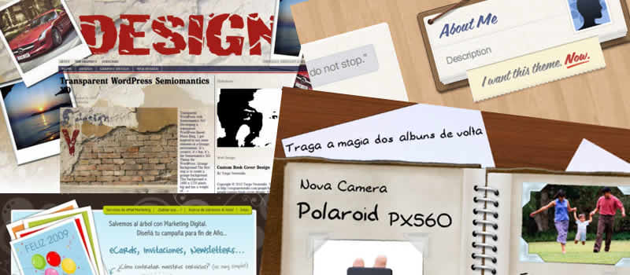

Right. If I see another Polaroid image on a website I'm going to... well, I'm not going to do anything really apart from sneer a little, and possibly tut. I remember the first timeb I saw a Photoshop plugin that produced a page curl effect.  We laughed, it seemed naff and a little silly.  Admittedly looking back the effect was poor and unrealistic, maybe this is why I never used it (if I did then I have conveniently erased the memory)

#### - Sketchy analogue metaphors are everywhere -

Today, looking round the interwebnetsphere - which is becoming more and more a process prompted by far too many '50 cool sites' type Tweets from the Twitterverse - I'm seeing analogue metaphors absolutely everywhere.  The current perceived trend in internet design is one dripping with design references to polaroids, hand written notes, lined-paper, post-it notes, paper clips, drop cap fonts, ripped card, papyrus, ink splots, crayons, paint, splats, splurts, sketchyness, scribbles.  It's driving me silly - especially when we end up creating what could be mistaken for a common or garden children's party invitation or a 1920's science text book and the world congratulates the designers for their originality and creativity. And has anyone under 25 actually seen a real polaroid or ever taken one?

I think I may just have reached saturation point as I'm sure I used to like all of these things too...  look up there in my header - I've done the same!  Infact  I'm currently working on a site with most of the things I just mentioned. Visual metaphors/analogies can be very helpful in user interface design, but don't overdo it as it is not only quickly becoming a very tired old cliche, but it's also becoming an easy option - an set of visual elements which we know will work together and everyone is familiar with.

This is an appeal though - if you are about to design a new site.  Please do something different.  Don't look at all these '50 cool sites' designs with huge serif fonts, and paper, and sketchy fonts, and splots and splats, and perpetuate it even further.  I know fashions always draw upon the past, but I swear we only reach to the past when we have no new ideas to draw upon to take us forward.  Let's find a new visual language and create something new and think of something exciting and different.

Oh no, I just recieved a tweet entitled:  'The New Hotness: Using CSS3 Visual Effects'.  The first hot 'effect' I see.  Polaroids.  Sigh.