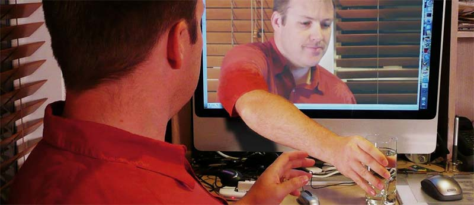

The other day I took a look at the young designer nominations for the .Net magazine awards, and had a little nose about their personal sites.  I was quite simply blown away by some of their portfolios and instantly felt old and a little bit inadequate.

===

As I am almost double the age of most these young hipster types I realised a few things I thought I would share with anyone else who may be feeling a little long in the tooth.

###Designers are not athletes

Take heart!  Your average design geek is not like a tennis player or a footballer. Quite the opposite in fact.  Tennis players, footballers and other athletic orientated careers do not last all that long, because of simple biology.  Older humans are not usually as quick or nimble as younger humans, and therefore the career of professionals in sport is limited.  

Your average web designer does not have to move very quickly.  In fact they don't really need to move much at all, apart from a few wrist movements and trips back and forth to the coffee machine.  Biological decay will do little to change this fact, although there may be extra trips to the toilet and confusion on the way back wondering which room you were last in.

> Even in a comfy high back chair, only minor wrist movements are necessary to create good, solid design.

No, design performance in the physical sense is never going to be reduced due to frailty. Even in a comfy high back chair, only minor wrist movements are necessary to create good, solid design.  Having a frail, forgetful mind on the other hand could simply create a new and completely original design aesthetic.

###Older is Wiser

The longer you spend in this game, the more you learn about it.  You can't really avoid learning more and more about clients and process, and the more experience you gain the more useful you become to add knowledge and perspective.  At least you should keep telling yourself that.

Youngsters may seem hip and cool now, but fashions come and go.  They have probably never built table based designs, nor even spent a whole day battling with an IE6 bug.  Of course those were miserable days in almost all respects, but they helped shape us old gits.  Today the old crew can realise how lucky we all are to be in an html5 / css3 world.  Youngsters merely exist in it, without proper perspective or appreciation.

There are exceptions to this of course. Some of these young 'whipper-snappers' have been coding and designing since they were 'knee high to a grasshopper' (Youngsters don't use such excellent sayings) and seem to know a lot more than you do.  The best approach is to simply nod... slowly... as they will assume you know what they are saying and may even fear they are 'teaching grandmothers to suck eggs' (another excellent saying, whatever the heck it means).  They will never know what you don't know unless you give yourself away.  Keep a list of things to research when you are off the hook then smile with satisfaction to yourself as you absorb their young knowledge too.

###Just copy them

However you look at it, fresh blood usually brings fresh ideas.  Of course the web being the web means you can simply steal any good ideas they might have and make them even better with all of that wisdom and experience.  You just need to keep your eyes open, keep listening to the Twitters whilst avoiding the urge to moan about your bad back too often.   Keep that avatar a little abstract, or better still use an illustration and maybe no one will even guess you are getting on a bit.

Stealing all the good, cool ideas, is of course a breeze.  You can also enjoy scoffing painfully and slightly patronisingly at the bad ones whilst muttering things like 'that will never work', 'I tried something like that once' and 'I remember last time this came around'.   Then steal those as well.

###Do not go gentle into that good night

So, don't worry.  You could be enjoying doing design work well into your wrinkliest years.  It's bound to still be fun and satisfying even if you do have to be wheeled about a bit and propped up with a pillow.  Never think you are too old.  Take a deep breath and just imagine all those excellent, fun new ideas that are heading your way from all those clever 14 year olds.

