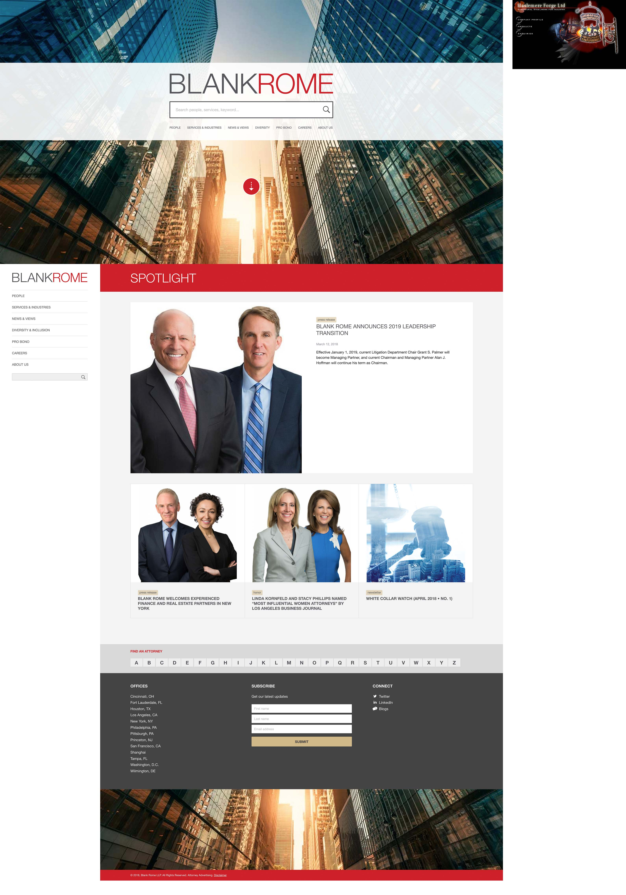

I found a screen shot of the first client site I ever worked on back in the 90's.  It was tiny!  Things have definitely changed.  I'd go as far to say we now have to design 50x times more pixels to create a website.

===

My first client was 'Haslemere Forge' a small business wanting their first web presence.  It was also my first experience designing and building an entire site.  I'd previously worked on sections of large University sites but never got to go near areas such as 'home' pages or 'main navigation'.

There were few conventions at the time, nor anything anyone considered as UX patterns.  This meant that each design took fresh new approaches to design.  Everything was up for grabs, search & navigation location and design could be anywhere or anything.

Just look at how small everything really was, 2018 on the left:

{.img-screenshot}
<h4>- Today and Yesterday -</h4

In some ways though - things between then and now have more in common than I initially realised.  Both effectively have a bold, visual splash screen with only navigation, logo and graphic visible.

I guess the ultimate user experience is that of an impactful first impression, and that seems unlikely to change.

