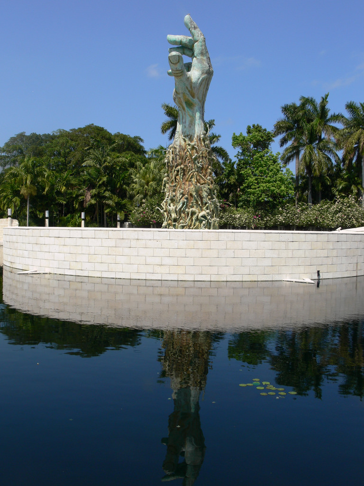
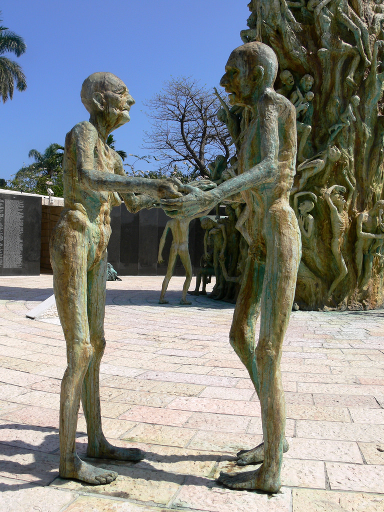
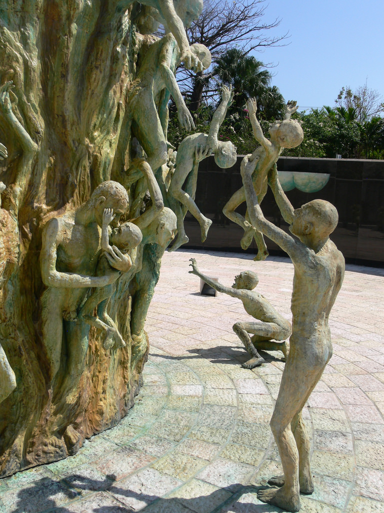
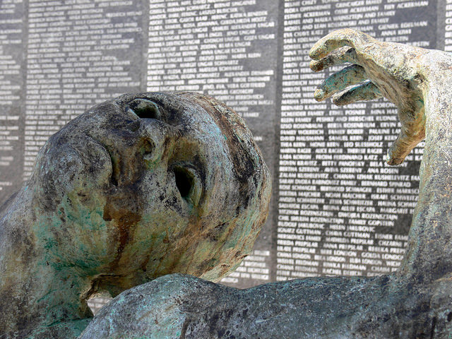

My father was a sculptor. He had a rare skill of visualising a block of material and extracting a three dimensional model from within it. He would always tell me when I watched him working; "it is in there somewhere. I just have to find it". His ability to produce an object at the required size and the exact weight seemed magical to me.

{.img-screenshot}
#### - Seen from afar -

As a result I've always admired sculpture; from the classics in the Vatican to Moore to the surreal delights of Dali right the way through to modern architectural statements. It has left me breathless, stunned me to see how folds of cloth, faces draped with veils and muscle tone can be rendered in marble. One thing I realised yesterday, however, is that I have rarely experienced any other emotion other than wonder or amazement. Yesterday I experienced sculpture that rocked me, moved me like nothing else ever has. 

{.img-screenshot}
#### - Saying goodbye after a lifetime -

The Miami Beach Holocaust Memorial in Florida seemed a little out of place at first. But this area has one of the highest concentrations of holocaust survivors in the world. From a distance you see just a large arm with hand reaching upwards, a bold statement in itself. Impressive in scale and placement.

As you approach, however, you start to see that the arm is actually more of a tower of people, figures climbing upwards and reaching outwards from its column. It is placed within a large circle of water allowing only a view from about 20 or 30m away with a low wall around its base on what you soon discover is a small island with a causeway at the rear. Reaching the causeway you pass black marble walls bearing the names of just some of the millions of souls known to have died in the death camps of the Holocaust.   

Reaching the causeway an eternal flame burns, light streams down through a golden star of David in a roof space and a song of remembrance is played subliminally intensifying the ambient emotional mood.

{.img-screenshot}
####  - Desperation -

Miami Holocaust Memorial Sculpture - saying goodbye after a lifetime

Walking downwards along the causeway with its narrow slotted windows you realise you are moving deeper, as you read the names of the most notorious concentation camps.   

Finally you step through into the open area of the central area and it hits you. At the time I visited there were no other people in this place, and yet in this space were people, life size, scattered, contorted. I was instantly overwhelmed both by the unexpected way this had been hidden from me until this point and by the placement, the distribution and the volume of the message these people shouted at me.   

Now i saw faces. These were the dying, the desperate, an old couple you knew had spent a lifetime together and without words were saying goodbye to each other. Children scared and alone, mothers and fathers desperate to save their children. Arms outstretched, faces of the dying with empty hollow eyes reflecting the depth of the horror, the hopelessness and the hellishness of their final desperate moments. This space around the column of the dying now made sense to me.

{.img-screenshot}
#### - Names remembered on the walls -

This was the beginning of the journey to the gas chambers, the figures climbing upwards were symbolic not only of an escape upwards in a spiritual sense to the freedom of death and a hope for eternity but the very reality of the trauma of the execution: the strongest fighting their way upwards to where the air could be found against the heavier gas below. I recalled the way bodies were discovered often in a pyramid as the strongest, most desperate climbed on top of others in one last hopeless struggle to live.   

This whole memorial symbolises a journey into the unknown, the path that the visitor walked to its core resonating with the path of the expectant family waiting to be resettled but descending instead downwards into hell itself.   

Even though I have been to the Auschwitz memorial in Poland and to Yad Vashem in Israel, both larger in scale and notoriety, nothing has touched me like this seemingly little known, deserted memorial in the most unlikely of places. I salute the sculptor and artist Kenneth Treister for leaving such a memorial not only to the Jewish people, but to art, to sculpture and to the very essence of humanity itself. 
