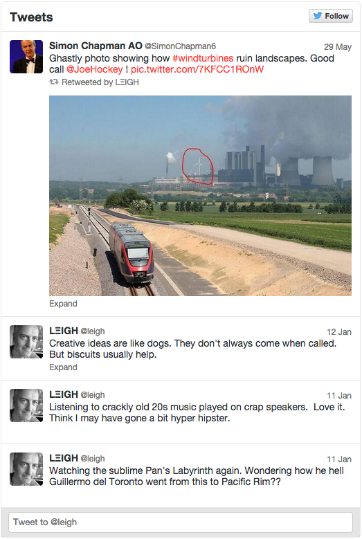
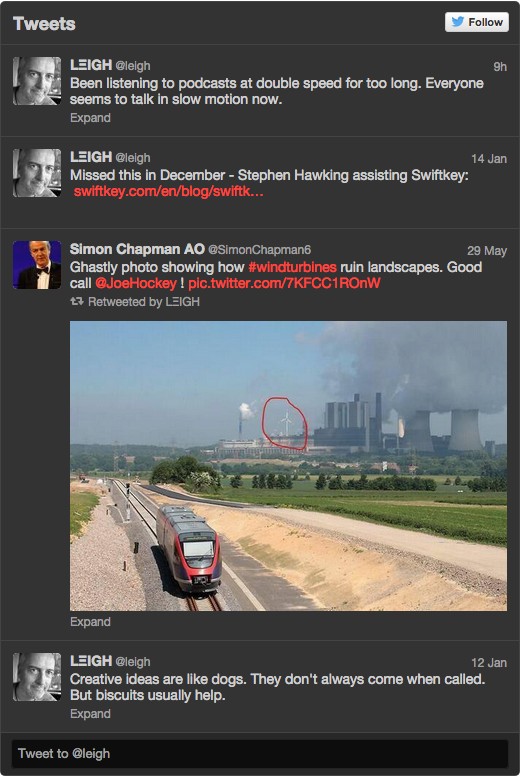
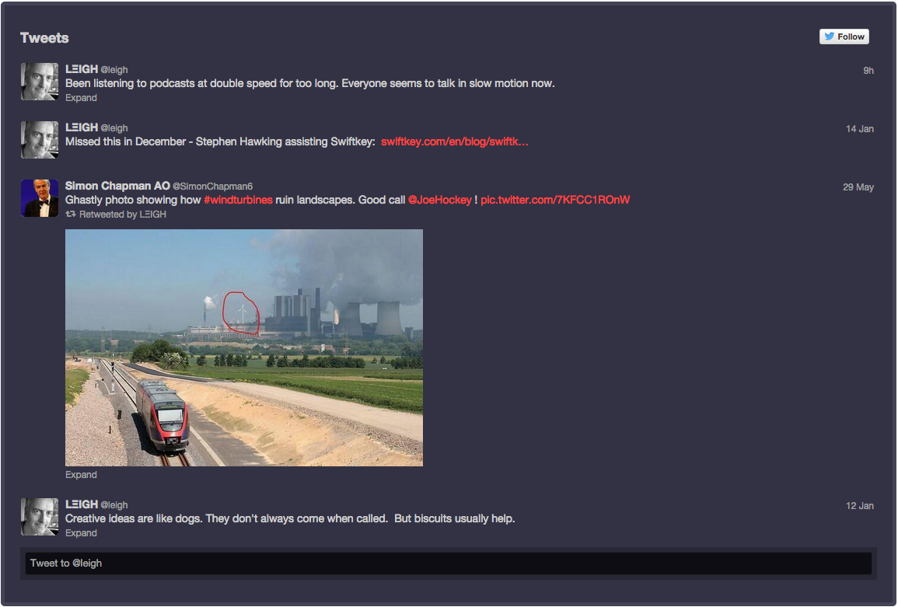
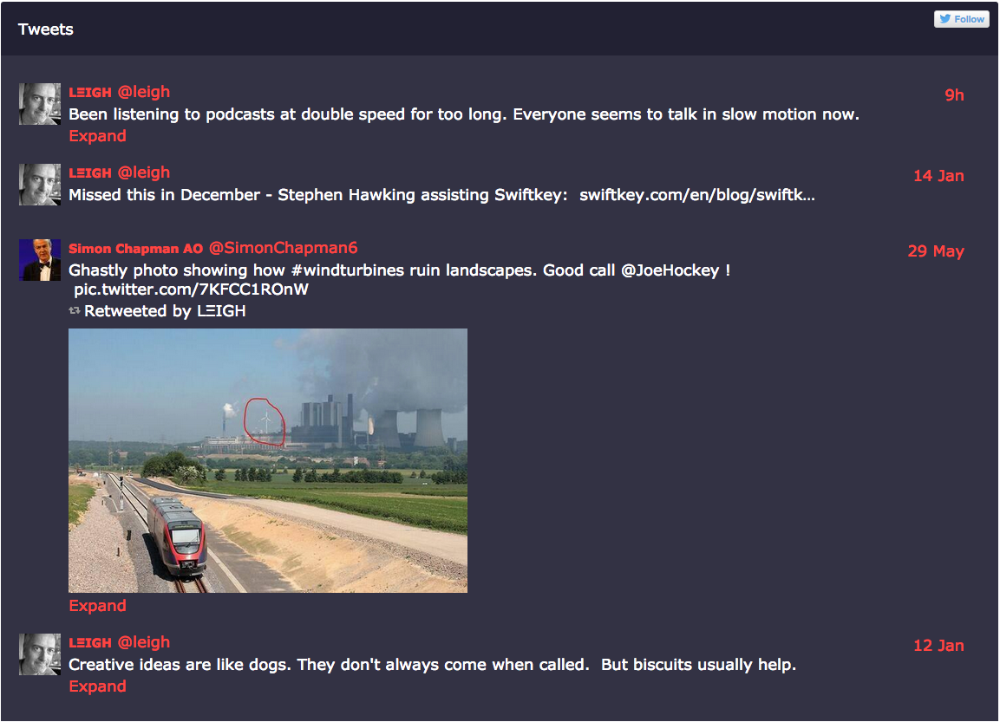

This post is simply a few examples demonstrating how much, or little the standard Twitter embed can be simply enhanced.

===

### Standard Twitter Embed Theme
  
The basic twitter embed is full of linework and teeny, tiny fonts.  It can look really messy and confused when placed into a similarly white page - which has been styled more pleasingly with better typography.  In those situations this default looks horrible, especially when full of hashtags and random pictures.  The ability to customise the link colour at least offers a bit of integration with a site/page's colour theme.   

<h3>Standard Twitter Embed (Dark Theme)</h3>

The standard dark theme feels a lot clearer than the light theme to me.  This is especially true when inserted into a page with a lighter coloured background, it offers greater contrast. But may be a little too heavy for many contexts.

<h3>Customising the Background</h3>

A simple way of styling the embed is to wrap it within a div and set the timeline to be transparent.  You can colour/texture/gradient the background div any way you wish, add a border, set the width to match the content container, but that's about it.  The fonts are still fixed and the font size still tiny.  But at least the visual noise of the regular embed can be reduced a little with this method and borders toned down or removed completely as show below.

<h3>Style with Javascript</h3>

One step further, it's possible to use Javascript to style the external iframe after it is launched.   This offers up the opportunity to style all elements of the embedded timeline, including fonts, font sizes and layout.

A better example of styling tweets from the embed code is [given on this Codepen](http://codepen.io/nerijusgood/pen/Ggqygo).

This could, however break Twitter's [Term's and Conditions](https://dev.twitter.com/overview/terms/display-requirements). It can also be a little hit and miss whether the styling happens on DOM load or not (hence a screenshot above rather than the embed code).  Often a page refresh seems to be needed to make it happen, but there are probably clever ways around this.

<h3>What else?</h3>

Of course there are many plugins that use the Twitter API that allow you to style things as you wish, however these have other pitfalls.  But if you've got a better solution for static sites or Drupal, please let me know below!
