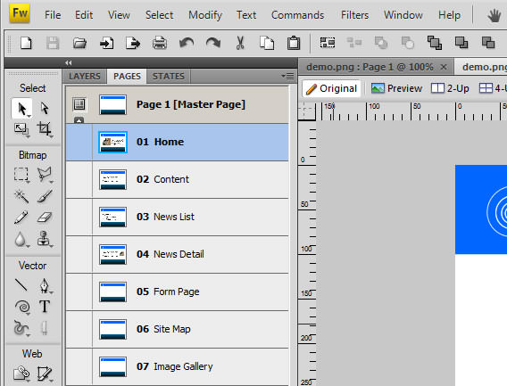
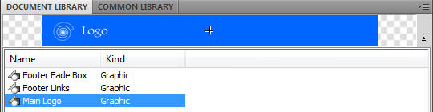
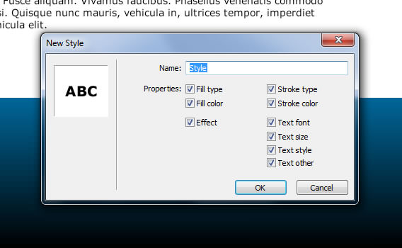
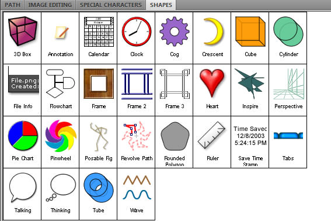
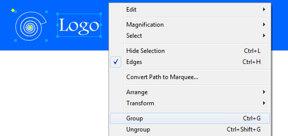
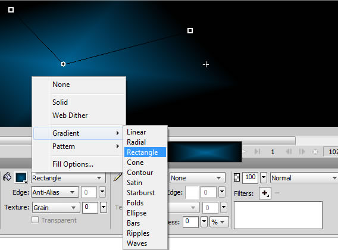
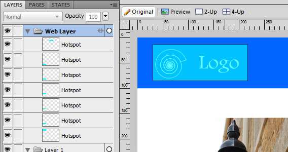
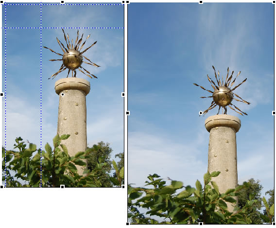
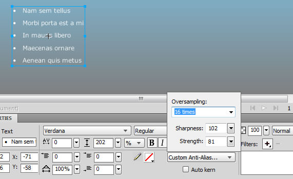

I have been a Photoshop user  for over  sixteen years, ten of which have been in a production web design environment.  I’ve got used to the way it works. 

===

I’m used to its feature set and how it does what it does. I’ve worked happily within that framework and mostly not digressed unless my requirements have been to design a logo – where a vector illustration package like Illustrator has come into its own.  More recently, however, I’ve begun to feel like I’m actually using the wrong tool for the job, in some ways like using a word-processor to replicate the work of a spreadsheet.

Just after Adobe’s CS4 suite was released, I decided to have another look at Fireworks – a package I had looked at a few times in earlier versions, but repeatedly given up on - each time falling back to Photoshop.  I played with it, and I was impressed by a lot of what I was seeing.  I persevered with it and started producing much of my my day-to-day work in preference to Photoshop.

### 1. Multiple Pages (with Master Page)

A Photoshop file consists of a single image with multiple layers.  A Fireworks file on the other hand allows multiple pages with multiple layers per page.  When working on a multi-page mock-up for a site design, the advantages of having all your assets contained within a single file are enormous.  Although having 5 different PSD files may be workable initially, once edits and changes are required, for example changing text in a consistent header or footer, things can soon get messy and time-consuming as changes have to be made across all files.  It’s also very nice that each page can be a different size, perfect for the different sizing which is often required between home pages and content pages.

As well as having multiple pages within the Fireworks .png file (the native file format)  the powerful Master Page allows you to define consistent template elements which appear across all other pages.  This is very powerful for defining a consistent header/footer which appears on each page and only needs to be edited on the Master Page to be updated across the design.  A single page can also be detached from the Master Page if there is a unique page requirement.

*Image 1:  Fireworks Page List*

### 2. Symbols

Symbols allow you to define an element or group of elements into a single object which can then be used all over your design across all your pages.  This symbol can then be edited in a single place and all changes are reflected throughout your document.  Imagine a graphic for a bullet icon which is used in many places across the design.  To change the colour or shape of the icon within Photoshop may require lengthy manual editing and copying and pasting across multiple files.  But with a multi-page Fireworks document using symbols, the change is only required in a single place for all the icons to be changed instantly across the design.  This is a very powerful feature enabling design tweaks which may have otherwise been abandoned due to the time and effort involved.

*Image 2:  Fireworks Library*

### 3. Styles

Styles are to Fireworks as a CSS style sheet is to a web page.  An items fill, stroke, font and effects can be defined into a style.  These styles appear on the styles list and can be applied to other elements in the document.  The real power lies in the fact that these styles can be amended and the changed cascading across the multi-page document automatically.  Imagine a style of image with a particular border and drop shadow used in many places which you decide would look better with a different border colour and no drop shadow at all.  If you have defined this image with your own style a single update will change all instances without all the pain.  Like with symbols this can be a huge time saver whilst encouraging design experimentation and consistency.

*Image 3:  Fireworks Styles*

### 4. Vector Objects

Fireworks offers the same basic tools as Photoshop for Bitmap editing but also has many extra vector tools.  Lots of vector shapes are welcome with many control points for creating stars, polygons and regular shapes. In addition the Autoshapes panel provides a more diverse collection ranging from stick men with moveable bones, to clocks, calendars and title blocks.

My personal favorite or at least the one I have used the most so far, however, is the humble rounded rectangle which has control points for individual corners  making  a single rounded corner on a rectangle a simple task compared to Photoshop.

I also like the precise pixel control over each of fireworks elements in the Properties toolbar which makes sizing of images and vector objects a breeze to set to required sizes.

*Image 4:  Fireworks Shapes*

### 5. Libraries

Both symbols, styles and vector shapes can be saved for re-use and collected into useful library resources.  In addition Fireworks ships with a common library of useful objects including buttons, browser and application elements for both Mac and Windows look and feel.  A number of pre-defined styles are also provided ranging from Chrome and wood styles to more useful line shading and tool-tip styles.

*Image 5:  Fireworks Library*

### 6. Grouping

In more recent versions of Photoshop layer groups have allowed you to virtually group objects together.  Though this works well, it requires a certain level of organisation moving individual layers into folders manually.  Unfortunately, I have never liked working this way. I like to work quickly as inspiration guides me without having to laboriously put everything into layers and name them. Though the layer group model is still present in Fireworks it allows you to quickly select individual elements and group them together.  The necessity to name layers is lessened by the fact they can be directly clicked on as in most vector packages, unlike Photoshop's right click and 'guess the layer' (which didn't get named!) method.

*Image 6:  Fireworks Library*

### 7. Interactive Gradients

Fireworks's Interactive gradients are a simple enhancement to what is already available in Photoshop, but the gradient being used has control handles allowing it to be moved and sized within the object.  A very simple enhancement but it works well and allows fine control and becomes particularly useful with using rectangular shading styles.

*Image 7:  Fireworks Gradients*

### 8. Web Layers

The web layer allow you to quickly add hotspot areas and links between the pages in your Fireworks document, or external URLs.  Whilst being useful for linking together simple wireframes, it can also be applied to fully designed mockup pages illustrating how a finished site may navigate.

Fireworks' initial conception was to help designers produce quick web sites with its ability to output html, rollovers and interactivity. All those features are still there and whilst you may not want to use the code it produces for final sites, for outputting your designs as an interactive mockup site, for example, Fireworks does a great job of exporting your images and html.

*Image 8:  Fireworks Web Layer*

### 9. 9-Slice Scaling

This scaling technique can be applied to bitmaps aswell as to vector objects.  This allows intelligent scaling as can be seen in the bitmap below; the four lines define vertical and horizonal sections on the image which will scaling areas when the image is resized, leaving the remaining areas untouched.  This can be applied to dialogues boxes, headers, scroll bars, anything which you would want to scale, but to scale non-uniformally.

*Image 9:  Fireworks 9-Point Slicing*

### 10. Small learning curve

Lots of things are just the same as in Photoshop - lots of keyboard shortcuts, tools palette - windows, toolbars, panel layouts etc.  It all mostly feels the same and I have got to grips with it intuitively moving from Photoshop.

In addition to these ten points, Fireworks is also cheaper than Photoshop!

## Some things I don't like so much

Though I love Fireworks so far, I have some niggles. These may be due to my lack of experience, but then if that's the case maybe my main niggle is the fact they aren't obviously overcome!

### 1. Masks

These aren't quite as intuitive as Photoshop yet.  I have always been a big fan of quick masks in Photoshop; i.e.; pressing ALT between 2 layers making the lower layer mask the layer above.  Though layer masks are the same, and there is the ability to paste bitmaps within objects using 'Paste Inside', these don't work quite as freely at the moment.

### 2. Text Anti-aliasing.

I can’t quite put my finger on it, but the anti-aliasing of text isn't quite as good as Photoshop's yet.  Even thought there is actually more control with the 'Custom Anti-Alias' panel - which allows you to edit parameters, sometimes text can look decidedly ropey at smaller sizes without lots of twiddling.

*Image 10:  Fireworks Text Alias*

### 3. Performance

I can't quite put my finger on this one either, but Fireworks doesn't feel as solid as Photoshop.   Maybe this is familiarity, but I feel like I'm working from within a piece of carved granite whilst inside Photoshop's windows.  I don't have that feeling with Fireworks yet, but maybe it will come. (I also don't know how many of the occasional memory problems and crashes have been due to running a pre-release version on Windows 7).

### 4. Snobbery

This is a terrible reason for not using one piece of software over another.  However, I feel it's very valid and I'm yet to tell a client I will provide them with Fireworks .png files rather than Photoshop PSD files (although multi-layered PSDs can be output directly from Fireworks).  Maybe there is a fear your reputation as a designer is at stake if you aren’t using ‘the big and mighty Photoshop’.  Maybe you fear you will not be taken as seriously, like in the old days of DTP using Pagemaker instead of Quark, or sequencing music in Cakewalk rather than Cubase or Logic.

## Conclusion

To be honest, I’m not 100% happy with either product for web design work. I still prefer and am more comfortable with some of Photoshop’s familiarity, but I’m enticed by all the other features that Fireworks offers to make life easier and production more streamlined.

I guess the conclusion if you own both is obvious; use them in tandem.  Use Photoshop for image editing, and more advanced image correction and manipulation, and use Fireworks for layout mockup of complex web sites which may end up with hundreds of layers. Note that with Photoshop installed, Photoshop's layer filters are directly accessible within Fireworks in addition to Fireworks own filter options (which have all the basics; drop shadows, glows etc. etc.).

I eagerly look forward to future updates to Fireworks and wonder how the two products may diverge further now that they are both under Adobe's wings.  Although I wish they would change the name from Fireworks, to something like 'Webshop' as I keep mixing up Fireworks and Firefox both in conversation and launching the wrong application all the time! But maybe that's just me.
