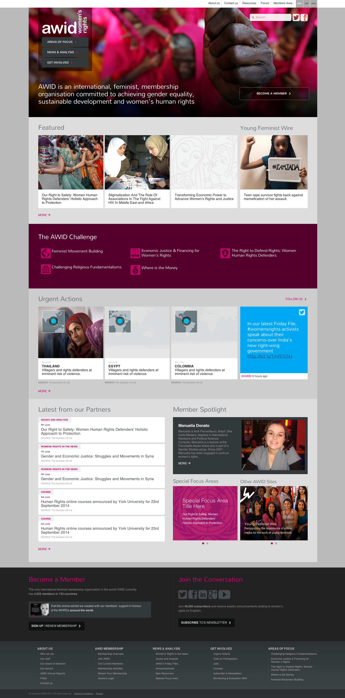

<a href="http://www.awid.org" target="_blank">AWID</a> is an international, feminist, membership organisation committed to achieving gender equality, sustainable development and women’s human rights. The site is primarily a portal of news and comment concerning the rights of women in developing countries.

===

The main challenge was to identify all of the different content types and create an information and navigational structure together with intelligent taxonomy to take all of the different types of article into account.

Many of the articles were merely third party articles with added preamble from AWID's own content team, and these needed to be dealt with in a different manner to content produced soley by the AWID web team.

### Images
Imagery for the site was another challenge.  Despite the fact that many articles had previously been added to the portal with very little or no thought to photography, the new design was created to enhance user engagement. This meant demonstrating the need and use of photography so that AWID's content producers could continue in the same visual style. Where no photography or image was going to be forthcoming, a set of placeholders were created to provide something of interest.

### Icons
A set of icons were designed to try and illustrate and label the main focus areas of AWID's work.  They were to be used as navigational aids and identifiers across the site.  An icon font was developed for all iconography and symbols used by the site.

{.no-effect}
#### The responsive design

### A Truly Global Project

One of the main challenges of this project was the wide-spread nature of AWID's core staff.  With offices around the world, workshops were conducted via screen sharing (GotoMeeting) to gather design input, and to present and discuss the work in progress.  

### Design Work

My roles on this project involved:
* Wireframeing and prototyping
* The site Information Architecture
* User Experience Design
* Visual design and aesthetics
* Page template design
* Icon design
* Design work in HTML/CSS

### Final Product

#### AWID Home Page 2015
{.img-screenshot}
#### Charity Focus Areas
{.img-screenshot}
#### Content Landing Page
{.img-screenshot}

