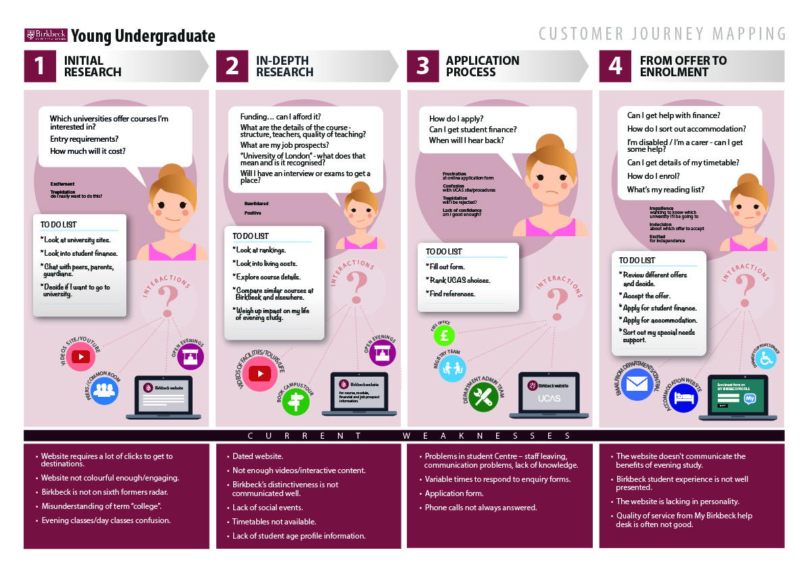
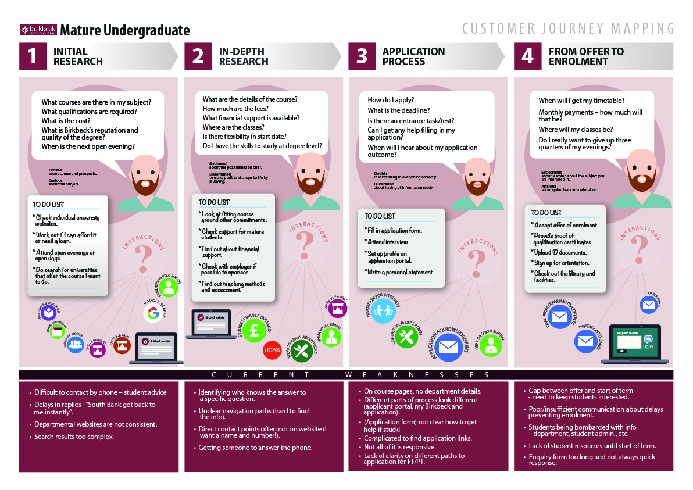
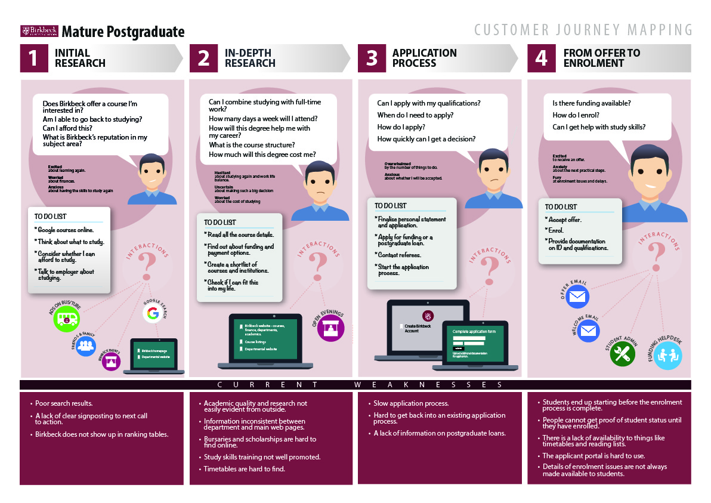
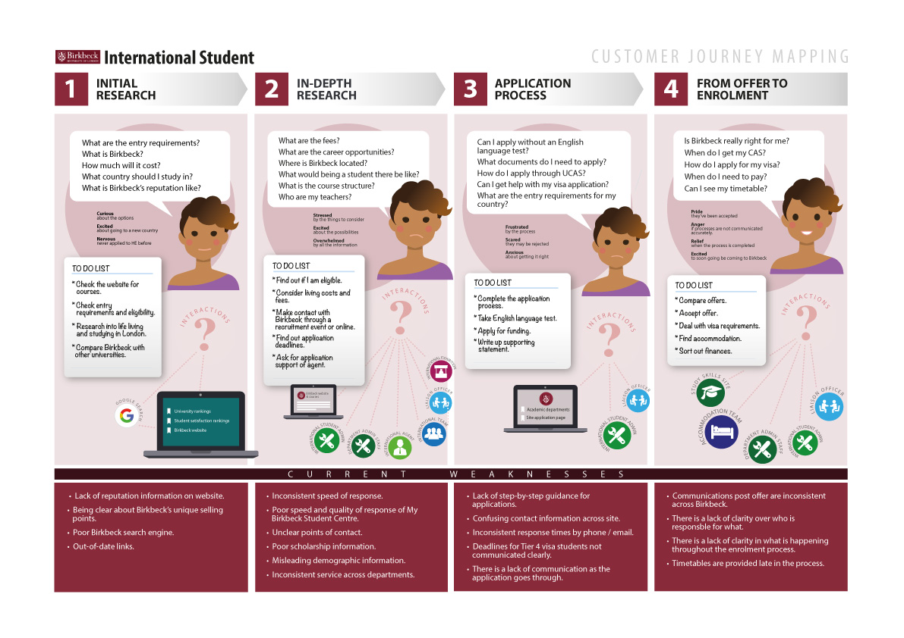
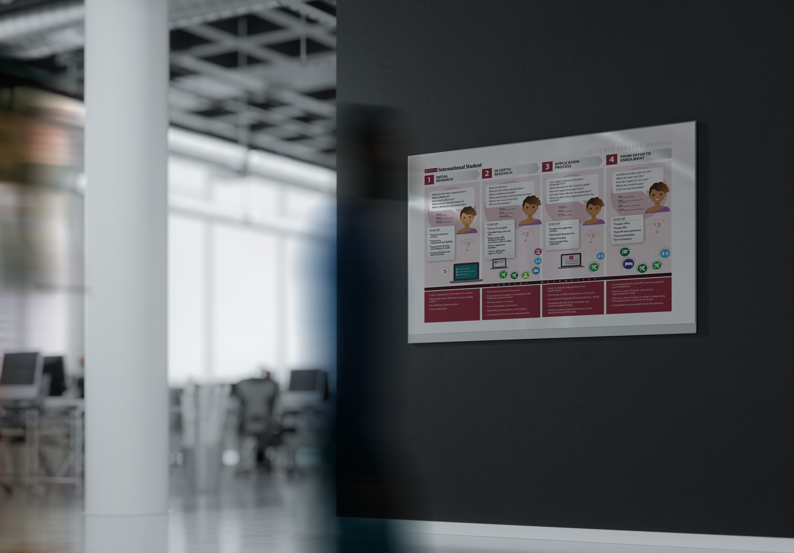

I created User Journey graphics for a large London University to help inform staff of the decision paths of some of their key prospective students.

===

### The Challenge

To transfer hundreds of post-it notes from a 2 day user journey workshop, into something visually meaningful - suitable to understand with little effort and look attractive framed on a wall.   These user journeys will be used to frame the next stage of the University's redesign process.

### Design Work

* High resolution graphics suitable for printing

{.img-screenshot}
#### -  Young undergraduates user journey -

{.img-screenshot}
#### -  Mature undergraduates user journey -

{.img-screenshot}
#### -  Mature postgraduates user journey -

{.img-screenshot}
#### -  International students -

{.img-screenshot}
#### -  How the journey might appear in context -
