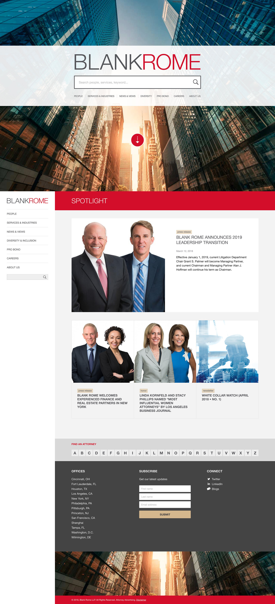
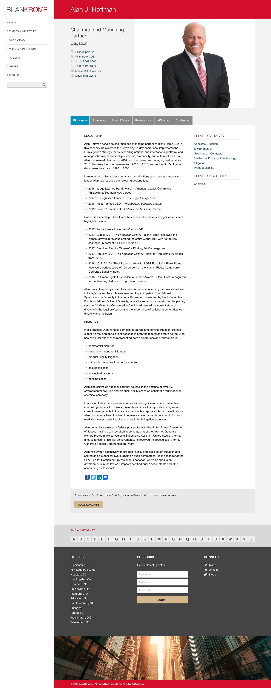
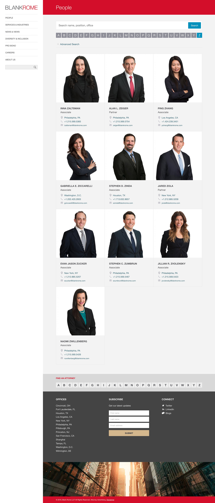
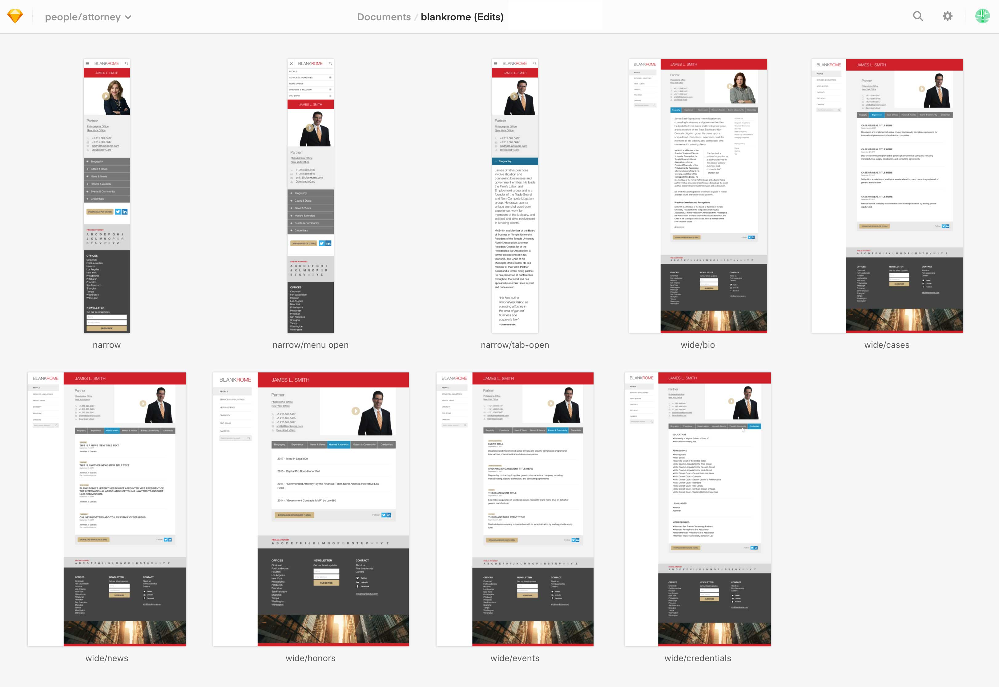
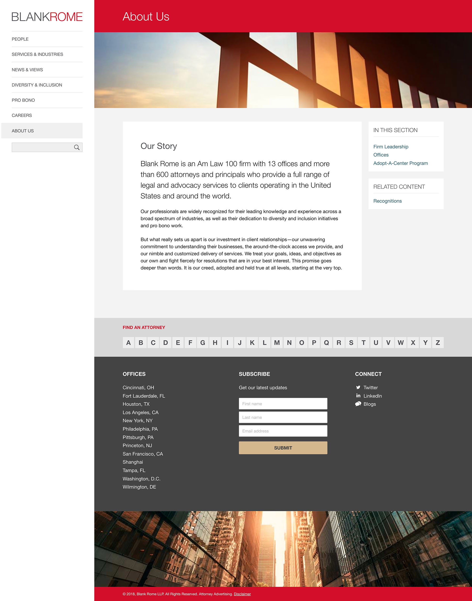
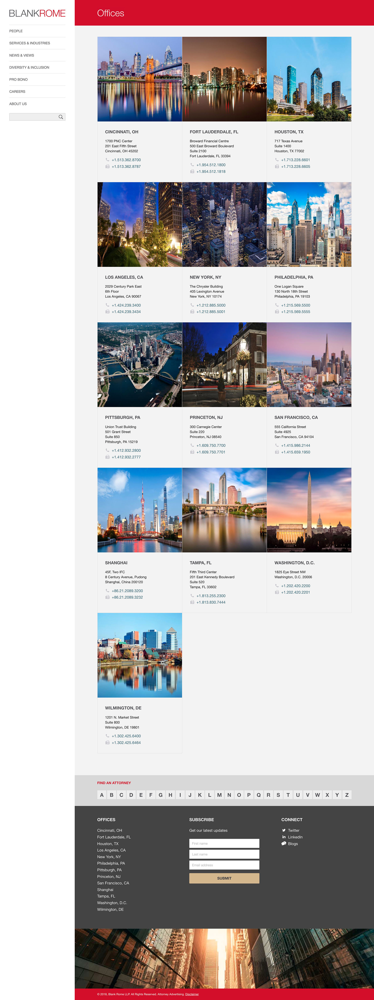
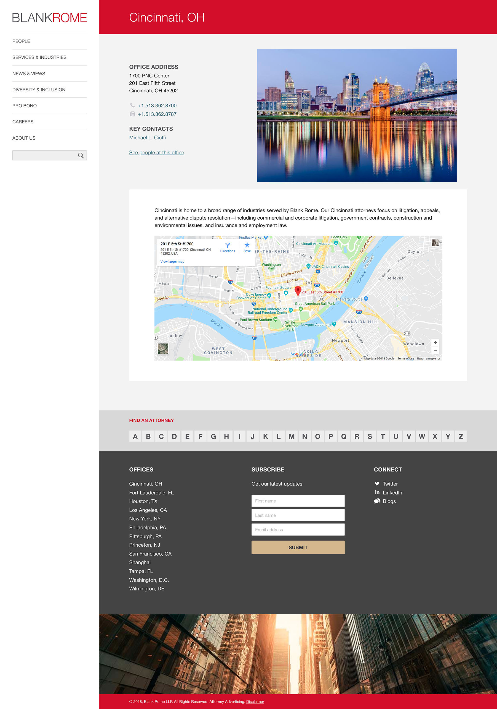

<blockquote>A bold, innovative site to get those needing help to the right attorney or practice with ease and confidence</blockquote>

<a href="http://www.blankrome.com" target="_blank">Blank Rome</a> is an US law firm with 13 offices around the world and more than 600 attorneys.

===

### The Challenge

The goal was to create a clear, impactful site working with Blankrome's new branding to develop a whole new look, feel and direction for the firm.

The greater challenges were understanding some of the complexities of the content and the pursuit of a static left hand navigation with a 'covering' style home page panel.  There was a desire to create a bold first impression of the firm, without trying to be too gimmicky or forcing a large download on visitors.

There were also a number of practical issues that shaped the design, such as reusing existing photography and generally having a limited repertoire or requirement for imagery across the site.

### Design Work

* Design exploration and research in 3 days initial workshop in Washington, DC.
* Interactive Wireframe in HTML/CSS
* Visual design and aesthetic exploration in static mockups
* Design work in browser in HTML/CSS/JS
* Overseeing Drupal 8 twig templates as built

{.img-screenshot}
#### - Home Page -

{.img-screenshot}
#### - Attorney Bio -

{.img-screenshot}
#### - Team Listing -

{.img-screenshot}
#### - Sketch mockup work -

{.img-screenshot}
#### - Basic text content -

{.img-screenshot}
#### - Office listing -

{.img-screenshot}
#### - Office content -
