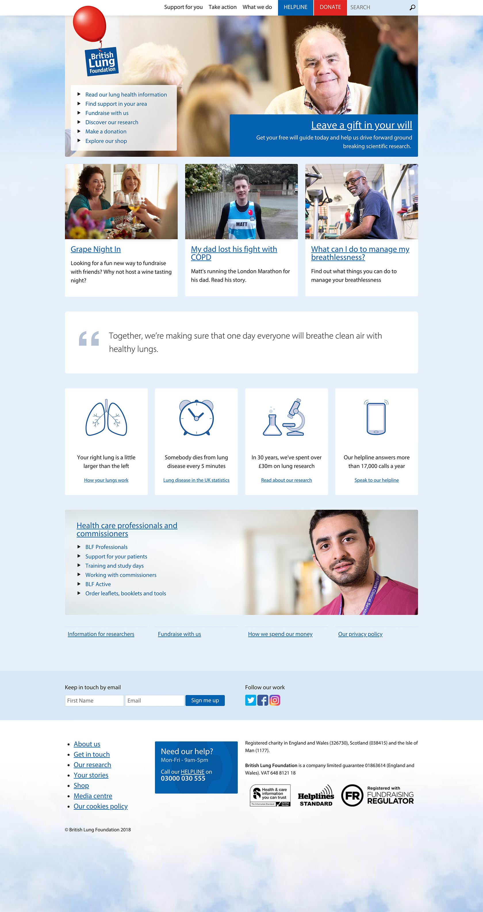
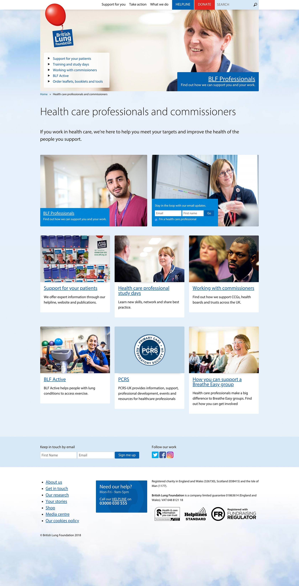
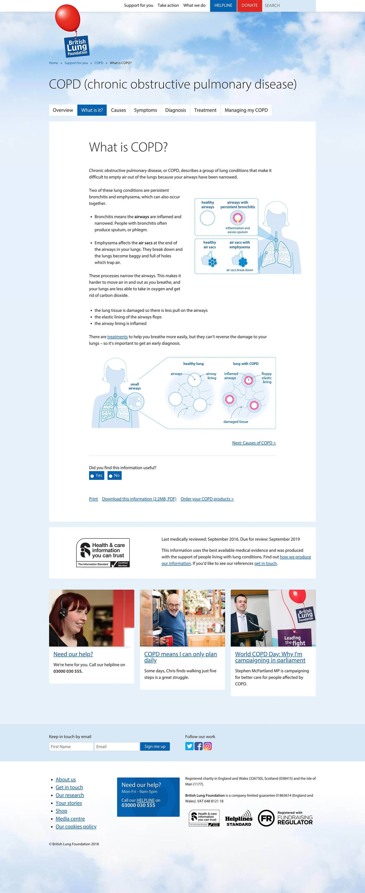
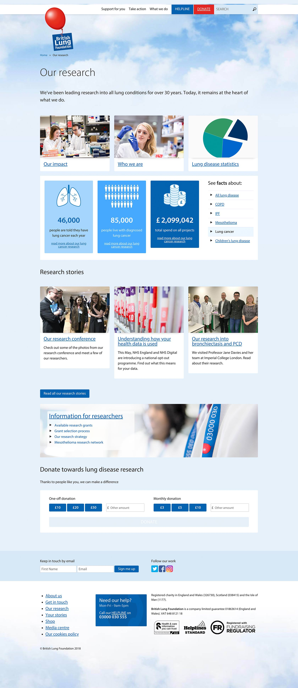

<a href="http://www.blf.org.uk" target="_blank">BLF</a> is a leading lung health charity based in the UK dedicated to providing support for all types of lung conditions.

===

### The Challenge

One of the main challenges was to create a shallow, simple to navigate site to get users to self-help information efficiently and effectively.  At the same time the site needed to clearly meet the charity’s need to ask for financial donations.

The visual challenge was to balance an authoritative visual style with a friendly, but not patronising look and feel. The
BLF logo also provided a significant challenge due to it's vertical proportions and text sizing.  It wasn't an ideal logo for the web, especially not at mobile widths.  Creative solutions were found by overlaying on top of images, and shrinking/animating at narrower widths.

### Design Work

* Kick-off workshops lead to the creation of a simple IA and static wireframes used to work through pages.
* A navigable HTML/CSS wireframe prototype was created.
* Moodboards were used to explore and establish the look and feel.
* Candidate page designs were created.
* A design proto-site was developed to demonstrate some of the main landing pages, navigation and how the content felt and responded at different widths.

{.img-screenshot}
#### - Home Page -

{.img-screenshot}
#### - Landing Page -

{.img-screenshot}
#### - Content Page -

{.img-screenshot}
#### - Research Page -
