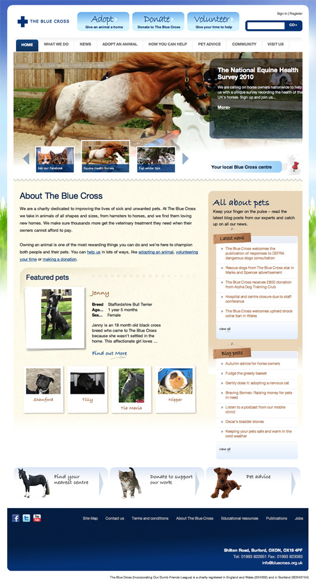
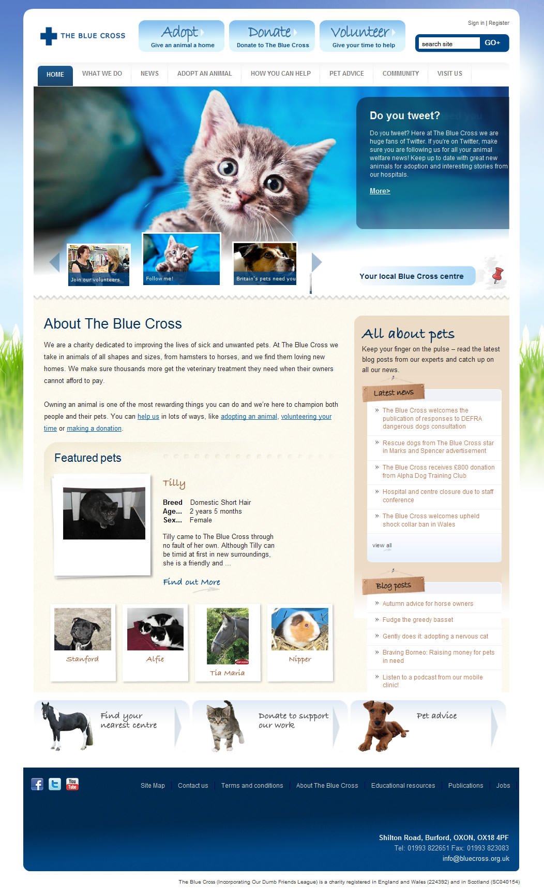

The Blue Cross is one of the UKs largest animal welfare charities, and as a nation of animal lovers it features highly in the nations conscience.  

===

### The Challege

The brief was to create a public facing, friendly site design pushing main calls to action across the site;  donations and adoptions.

### Design work

* Moodboards
* Design mockups of key pages

#### - Home page 1 -

#### - Home page 2 -