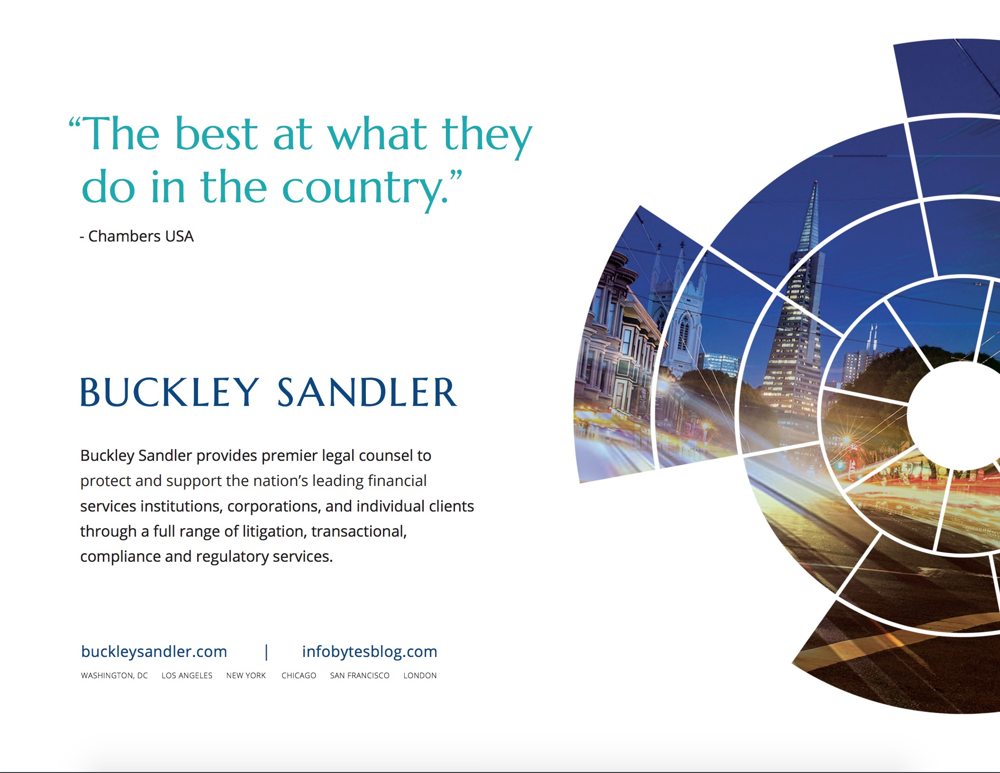
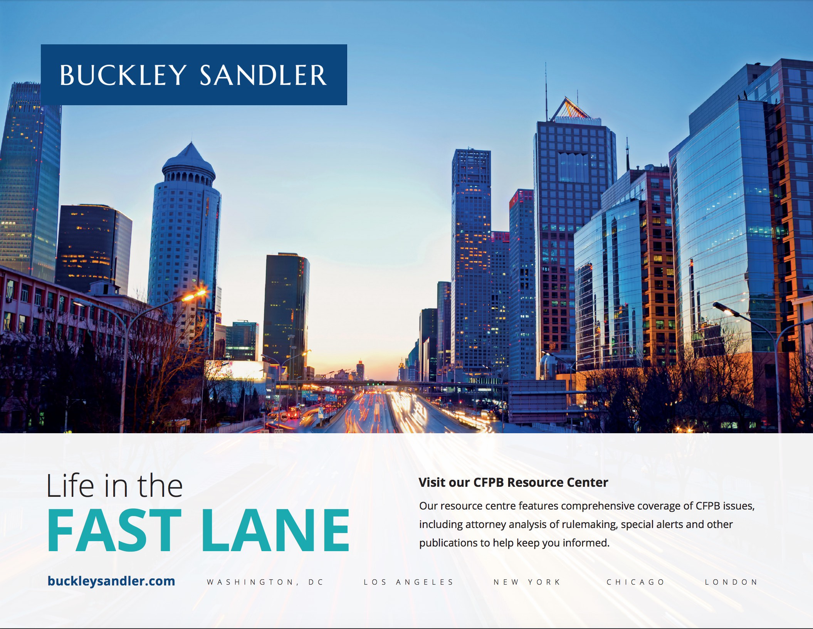
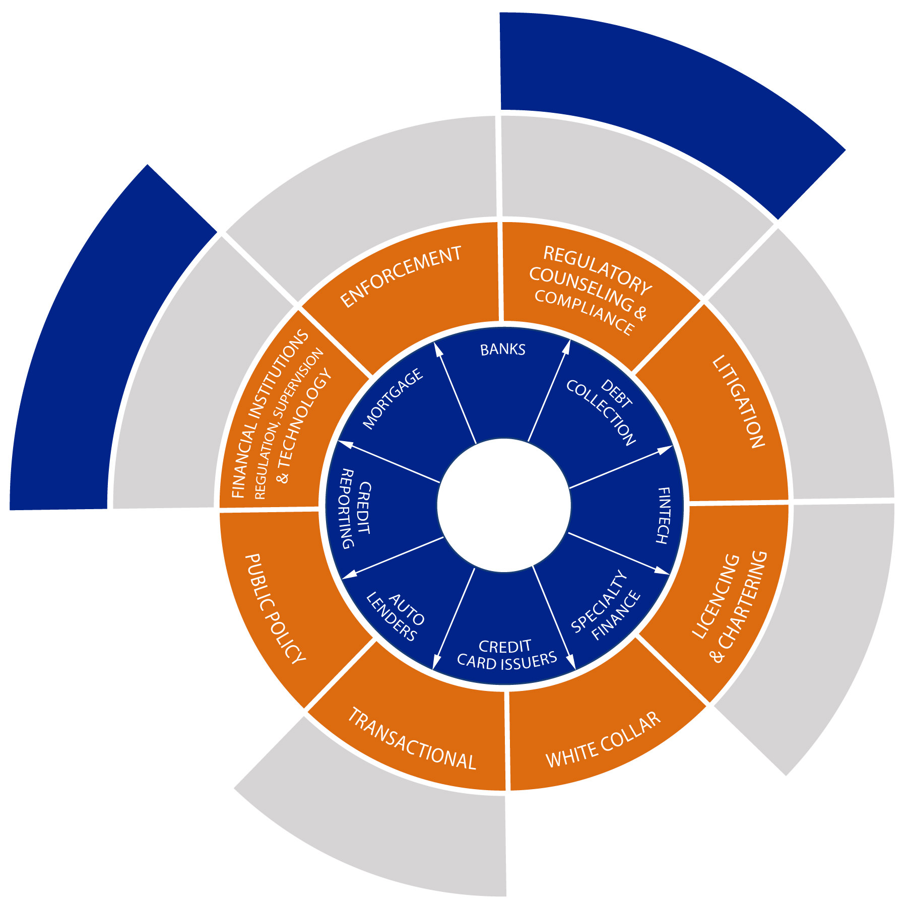

<blockquote>A strong, clear, and energetic new brand for a large international law firm.</blockquote>

Sometimes it's clear when starting a redesign, that an important aspect of the site is wrong - the branding.

===

On occasions there is the willingness, scope and budget to address this.

Having past experience of print design, I turned my hand to redesigning the brand in effect to improve the look of the website.  Drastic needs sometimes require drastic action.

### The Challenge

The challenge was to create a brand to best communicate the values we identified in a collaborative workshop with the marketing team. The old brand had been created by the founder and included a graphical element that meant little to the large, matured firm.  The reconsidered branding was also a chance to remove the LLP designation.

The additional challenge with the brand was to create a concept, that was meaningful in an intrinsic way to the firm.  Numerous graphic devices were experimented with until the concept of the core principles, or 'sphere of influence' of the firm was developed into both an informative infographic, and an abstract device to use in both masked image and solid forms.

### Design deliverables

* Logo design, with stacked and single line variants
* New brand colour palette
* Business cards, letterheads
* Favicons
* Microsoft PowerPoint and Word templates
* Adobe InDesign templates for advertising use
* Signage for events
* Twitter, linkedIn and Facebook logos and graphics
* Key graphic visualisation ident to be used across digital and print.
* Branding document delivered as an InDesign document.

{.img-screenshot}
#### - Final Logo -

{.img-screenshot}
#### - Secondary Logo inverted -

{.img-screenshot}
#### - Logo and graphical ident in print work -

{.img-screenshot}
#### - Print advertising -

{.no-effect}
#### - Spheres of influence graphic ident, infographic -