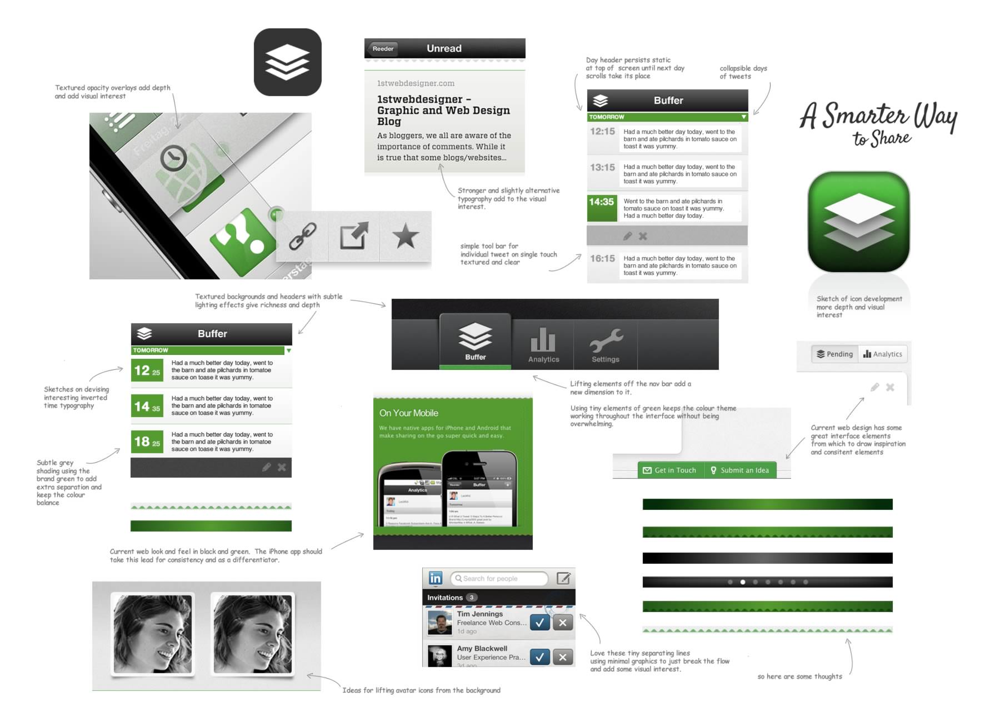
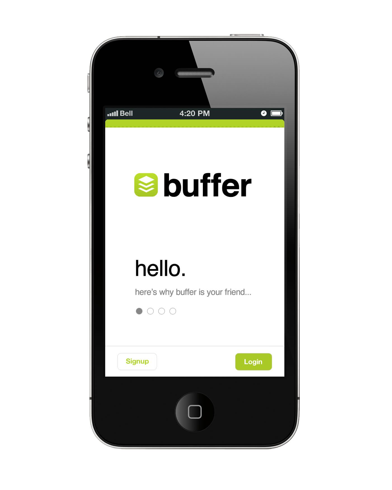
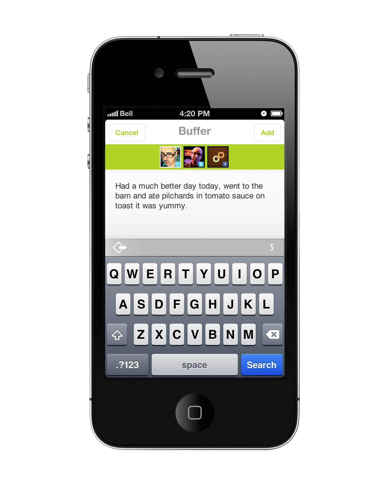
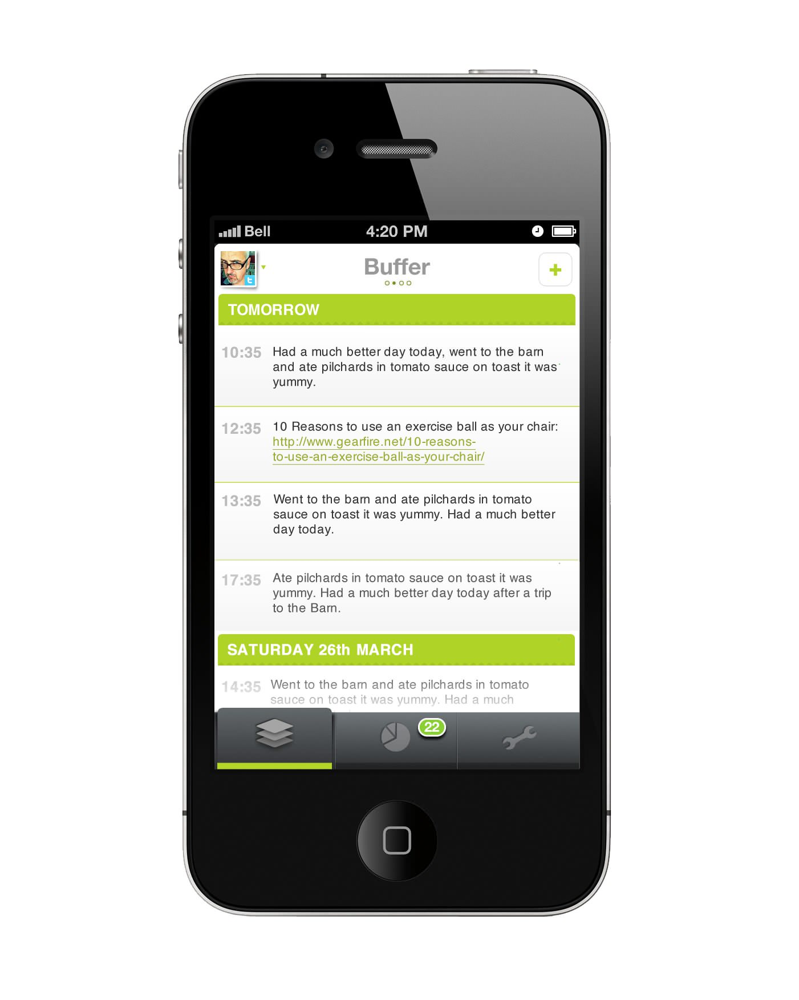
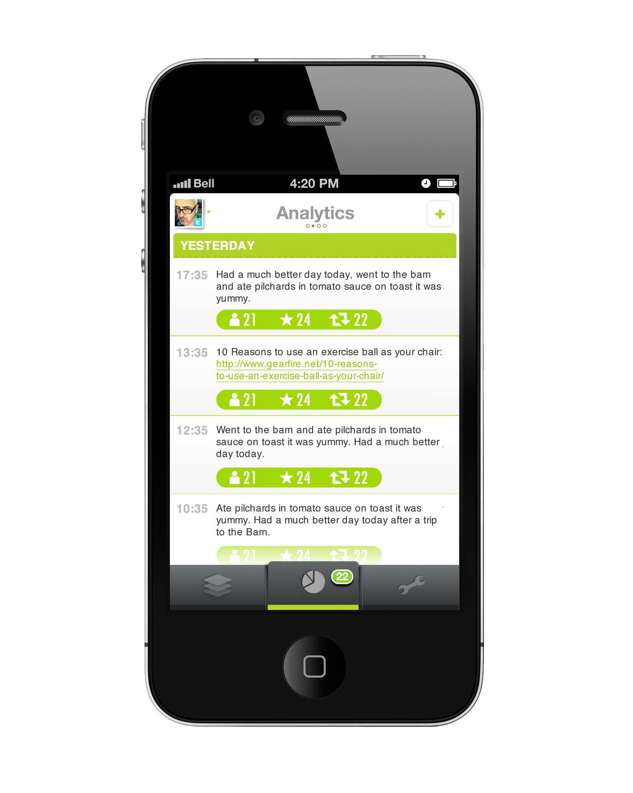

A range of designs for an iOS application called Buffer.  Not implemented.

===

#### Design work 
* Wire-framing
* Mood boards 
* Visual design work  

#### Design

{.img-screenshot}
#### - Mood board -

{.img-screenshot}
#### - Intro walkthrough screens -

{.img-screenshot}
#### - Add a tweet -

{.img-screenshot}
#### - List buffered posts -

{.img-screenshot}
#### - Analytics -
