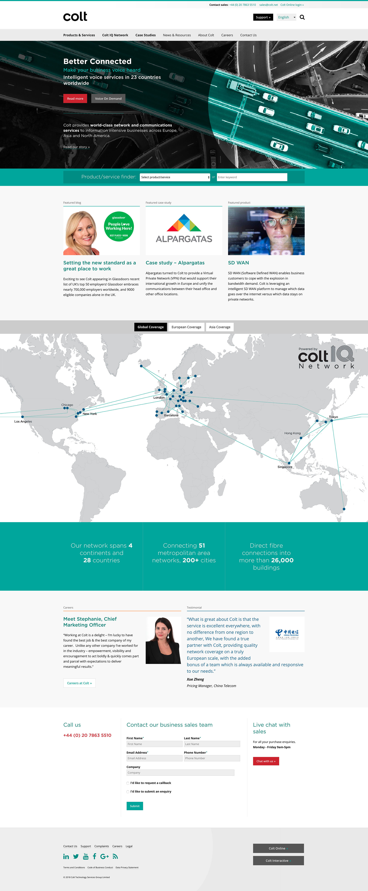
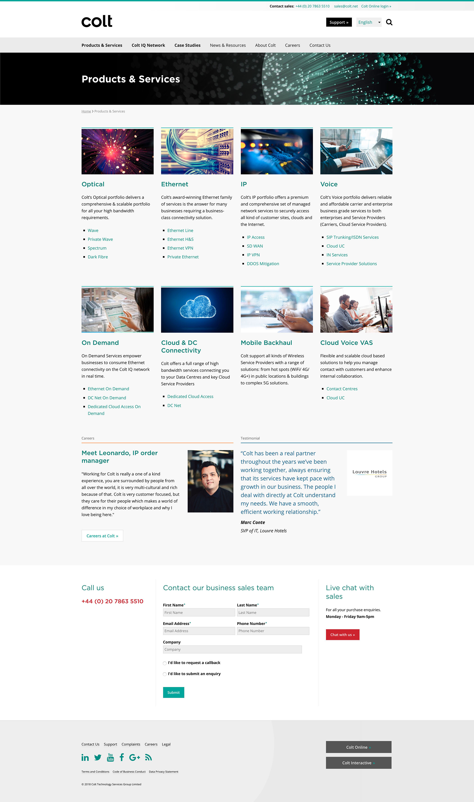
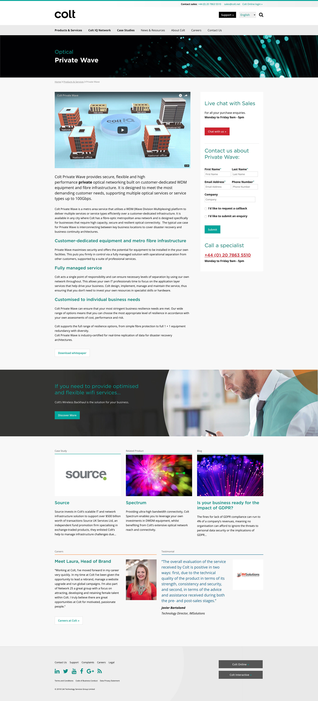
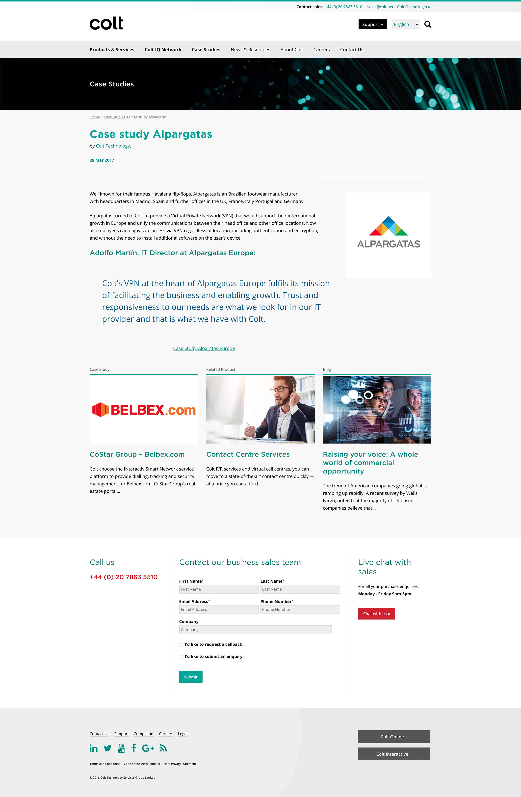
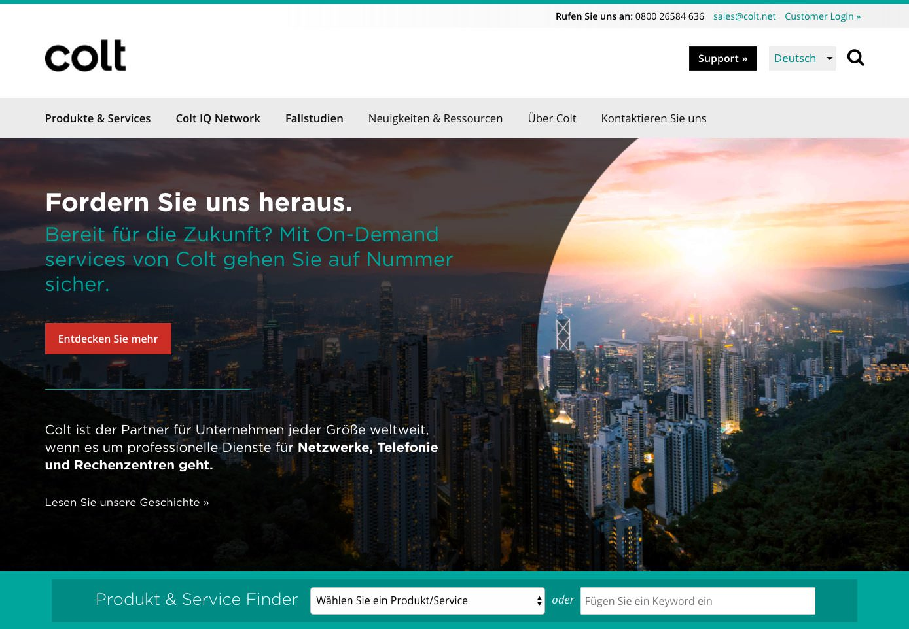
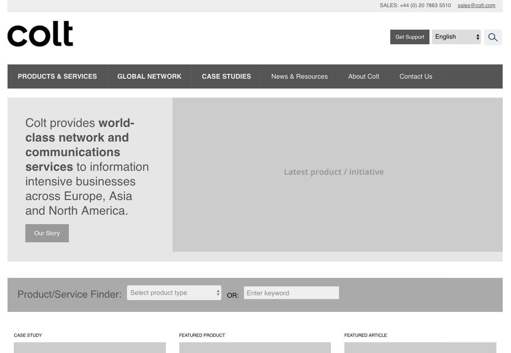
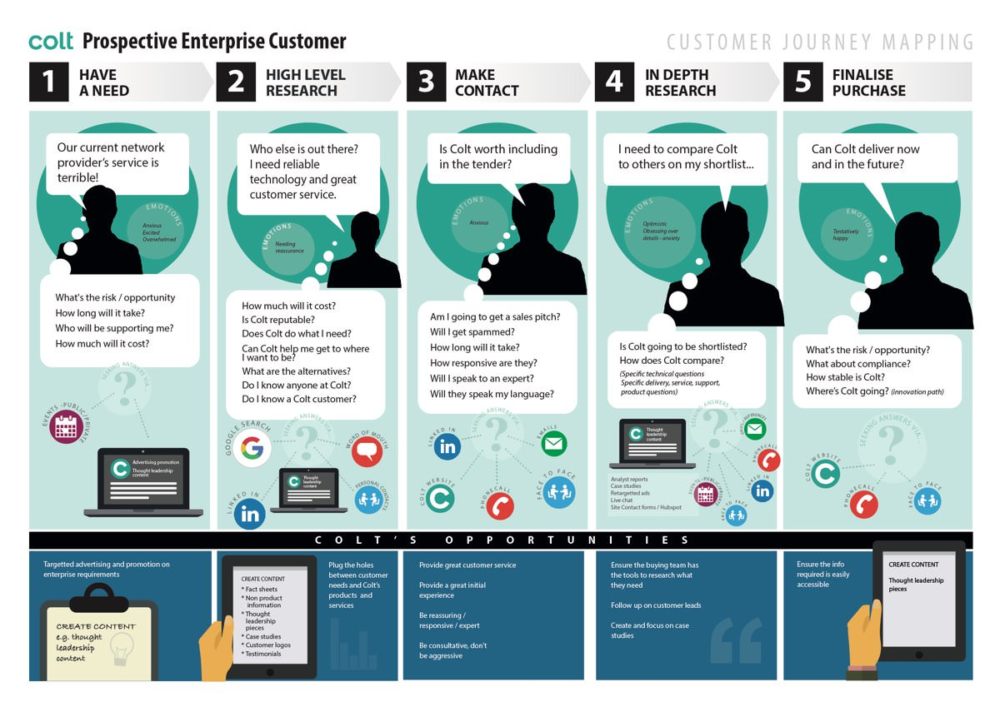

<blockquote>A fresh emphasis on connecting partners with products in a heavily componentised pattern library to play nicely with Beaver Builder in WordPress.</blockquote>

<a href="http://www.colt.net" target="_blank">Colt</a> provides communications services to information intensive businesses across Europe, Asia and North America.

===

### The Challenge

Colt's Wordpress site needed a new Information Architecture and a re-skin to bring it up-to-date and iron ouy usability and user experience problems.  The delivered design patterns created need to work seemlessly with Beaver Builder, their landing page creation tool of choice.

Part of the design challenge was to create a more visual experience, in a way that was light weight and easy to achieve using Wordpress and stock imagery.  This had to be achieved without diluting the main teal/black/grey brand colours, introducing secondary brighter
colours without becoming overtly colourful.

Another major challenge was the product selection and details pages. This was wire-framed extensively to ensure the categories were reduced and clear, and that Live Chat and help was available as prominently as the product data on the details page.  This included a desire for more prominent
video content.

### Design Work

* Initial stakeholder research and user journey mapping
* Design of graphical user journey maps (example <a href="#map">below</a>)
* Creation of an HTML wire-frame to demonstrate IA and UX
* Design mockups to illustrate design direction
* Navigable responsive design prototype of key site pages, designed in HTML/CSS/

{.img-screenshot}
#### - Home Page -

{.img-screenshot}
#### - Product Landing -

{.img-screenshot}
#### - Product Description -

{.img-screenshot}
#### - Case Study -

{.img-screenshot}
#### - German home page -

{.img-screenshot}
#### - Interactive HTML wireframe -

{.img-screenshot}
#### - User Journey -
