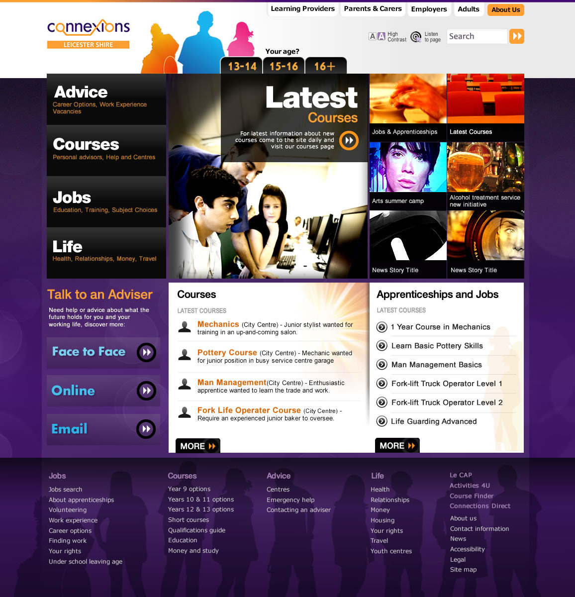
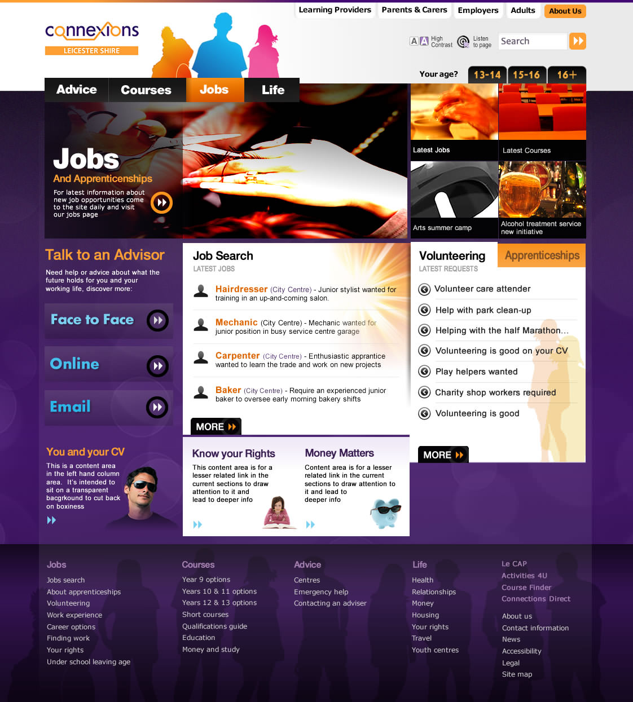
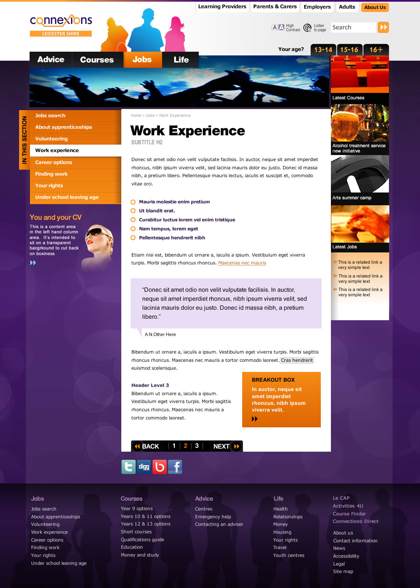
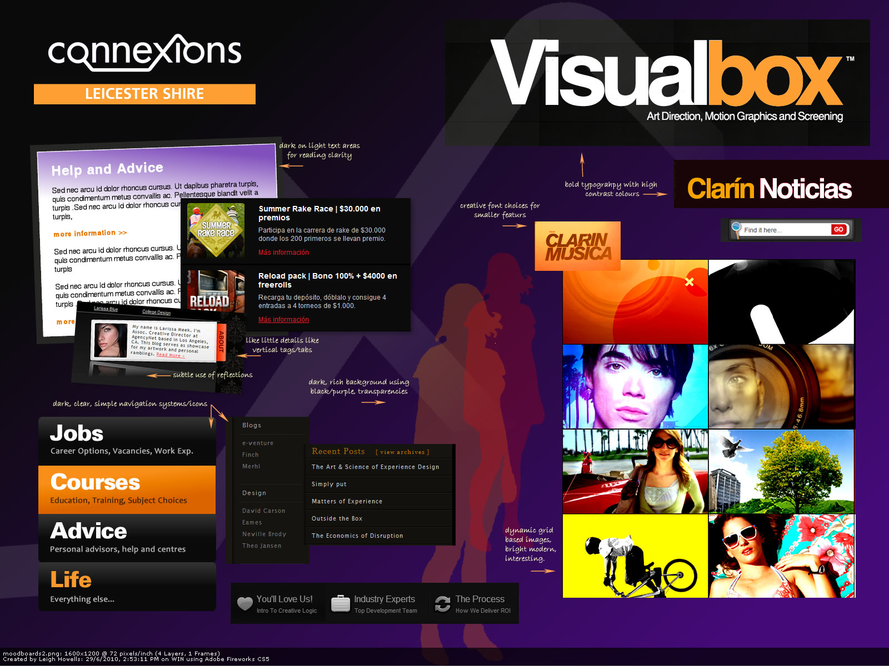
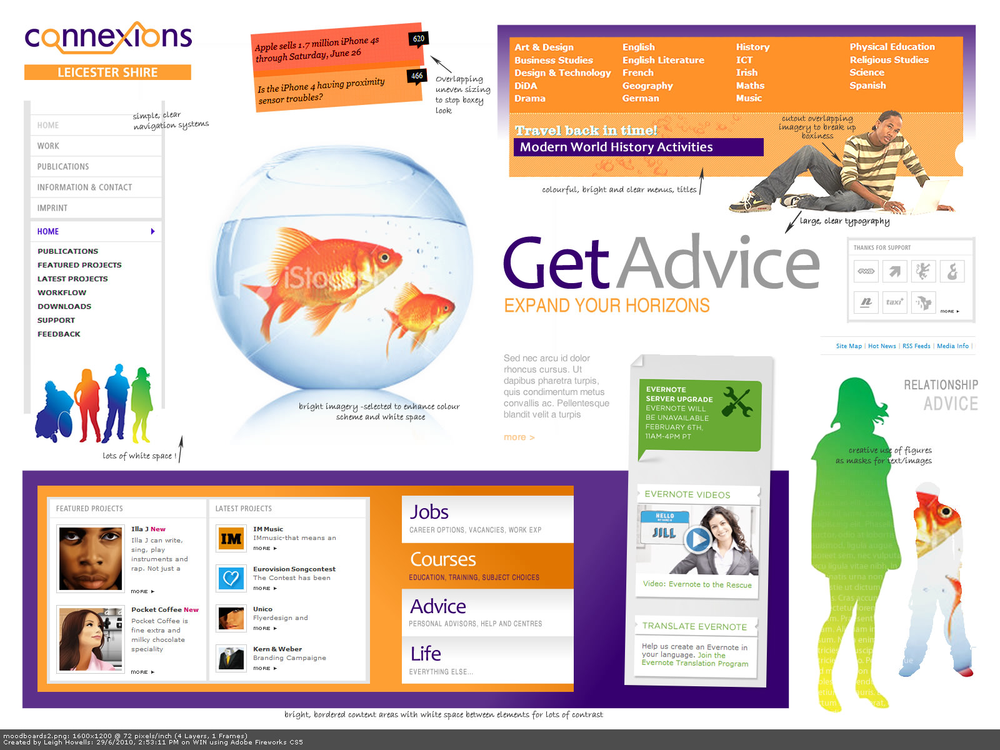
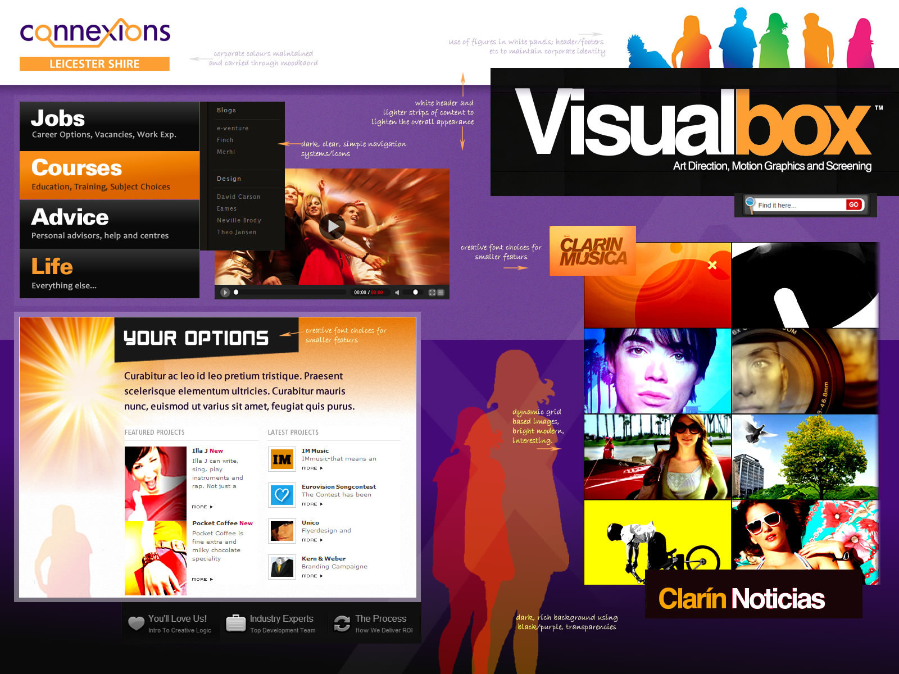

Connexions was a careers resource site for a teen audience in Leicestershire catchment.  The look of the site had to hit a compromise between youth appeal and professionalism for staff, teachers and careers advisors.

===

### Design Work
* Wire-framing workshop
* Usability and design testing sessions  
* Mood-boarding
* Visual aesthetics 
* High fidelity prototypes
* HTML and CSS build

### Final Product

{.img-screenshot}
#### Home Page

{.img-screenshot}
#### Landing Page

{.img-screenshot}
#### Content Page

{.img-screenshot}
{.img-screenshot}
{.img-screenshot}

#### Moodboards