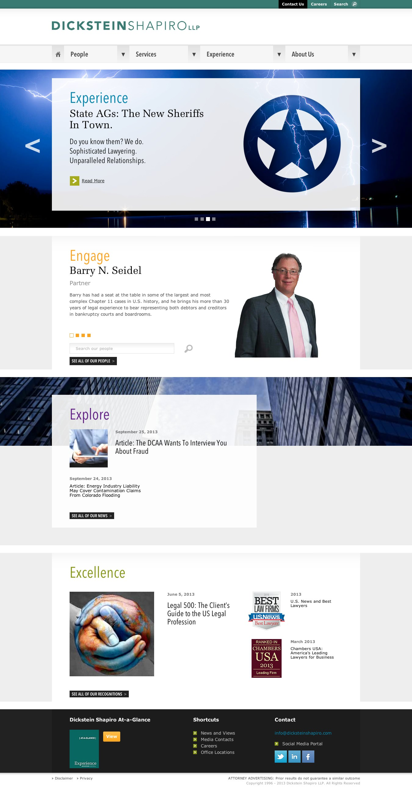
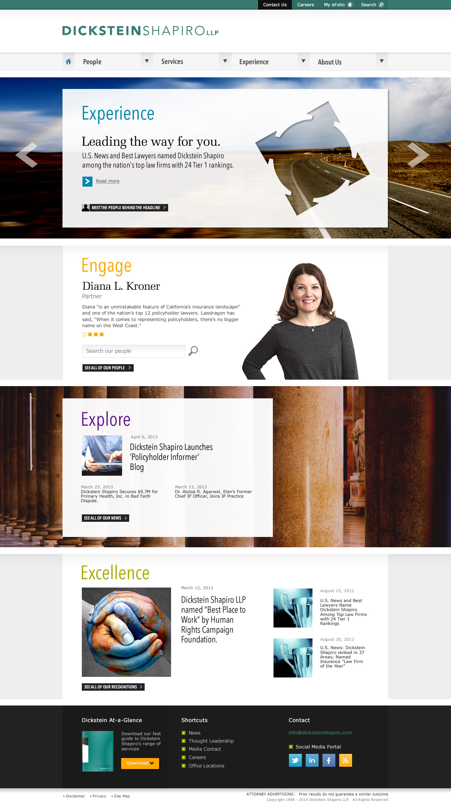
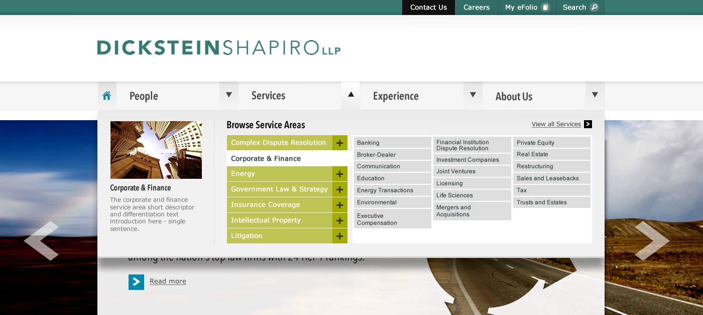
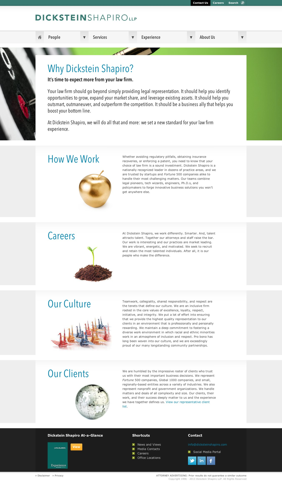
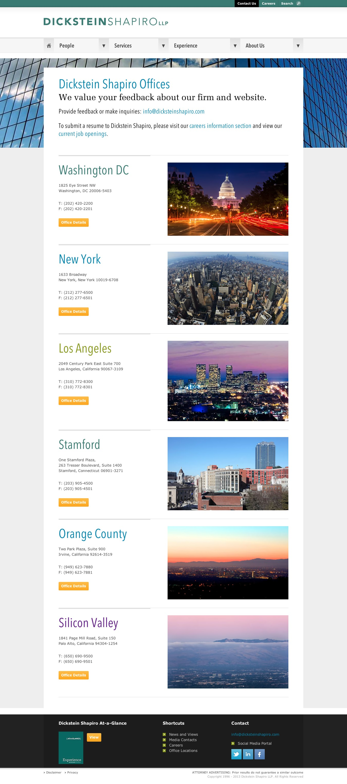
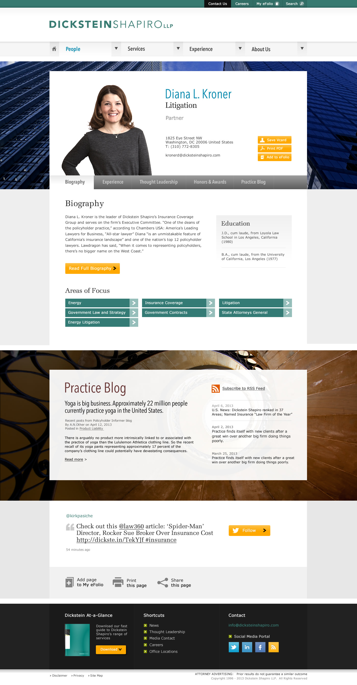

The Dickstein Shapiro site was a large project,  a top US law firm based in Washington spanning a 2 year period.

===

### Design work

* competitor review
* heuristic analysis and review
* stakeholder interviews with key attorneys
* user personas/journeys
* multiple moodboards 
* wireframing
* prototypes 
* design concepts
* design mockups

The site was fully responsive, featuring subtle parallax scrolling on the home page and large dynamic visuals for wide screen displays.  (Front end development was carried out by the very talented <a href="http://www.sheerman.co.uk" target="new">Dan Sheerman</a>).

Home page with parallax panels making full use of wider displays

Home page variant.

Detail showing enhanced flyout navigation menu for wider screen devices.

About us magazine style page.

Office location page.

Attorney biography multipanel page.

Narrow width mobile responsive view.

Here's the <a href="http://dev.dickstein.linux.hs.to" target="new">live site</a>.