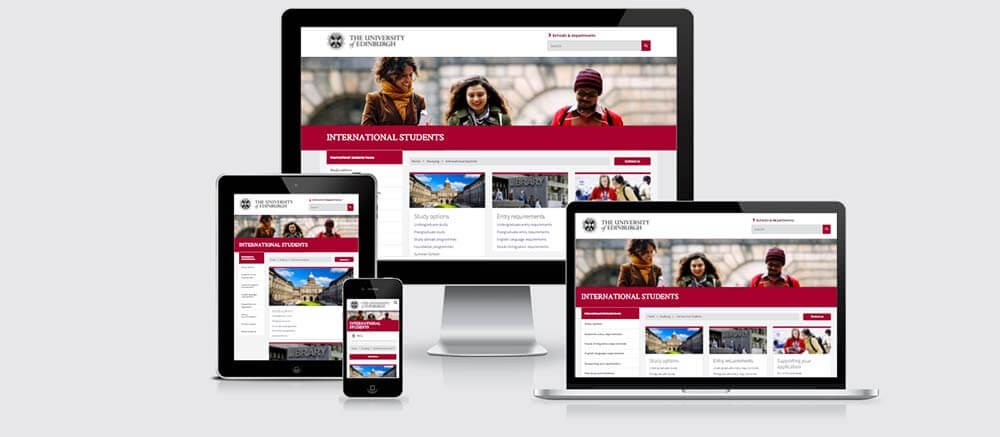
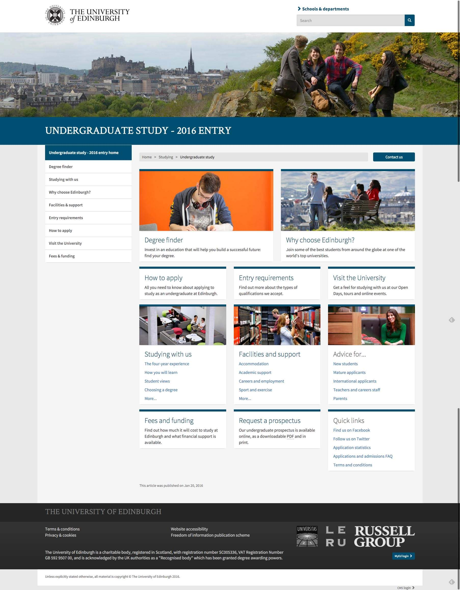
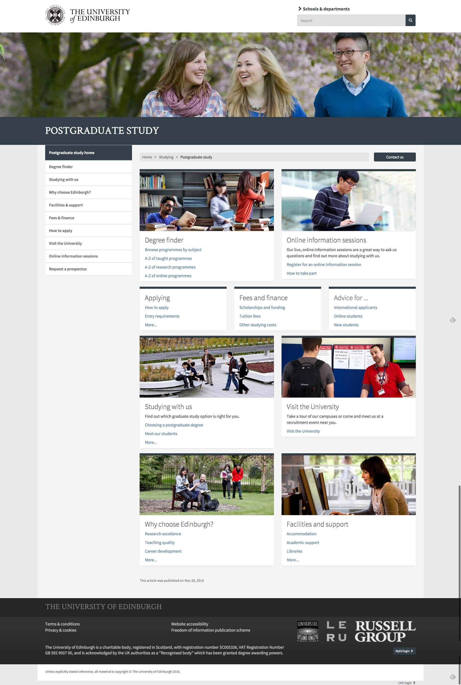
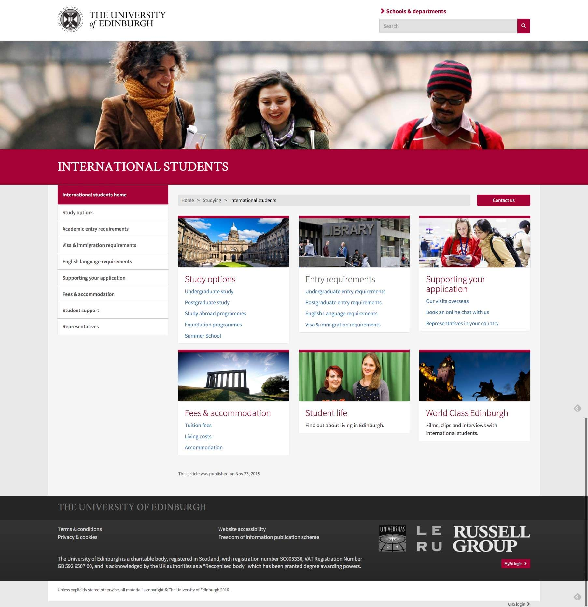

<a href="http://www.ed.ac.uk" target="_blank">The University of Edinburgh</a> wanted to redesign the 'customer facing' level of it's main content pages, and gradually roll out a redesign across a huge number of internal pages and microsites.

===

### The Challenge

The main challenge was to create a design system that could be customised to allow different departments to create their own sense of identity whilst keeping a sense of overall consistency.  The system had to be simple, easy to read, fully responsive and very flexible allowing the creation of many different types of page from the patterns provided.

{.img-screenshot}

### Framework

Another challenge was the decision by the University to adopt the Bootstrap framework.  The idea being that such an open source framework, which was contributed to by a community would allow a more open, extensible architecture than any stripped back, lightweight framework that would have been created by bespoke coding of the designs.  This lead to a procees of wireframing and designing in the browser using Bootstrap.

### Design Work

* Wireframing in Bootstrap
* Visual design and aesthetics
* Page pattern designs
* Design work in HTML/CSS/JS

### Final Product

{.img-screenshot}
#### - Home Page-

{.img-screenshot}
#### - Postgraduate Hub  -

{.img-screenshot}
#### - International Hub  -
