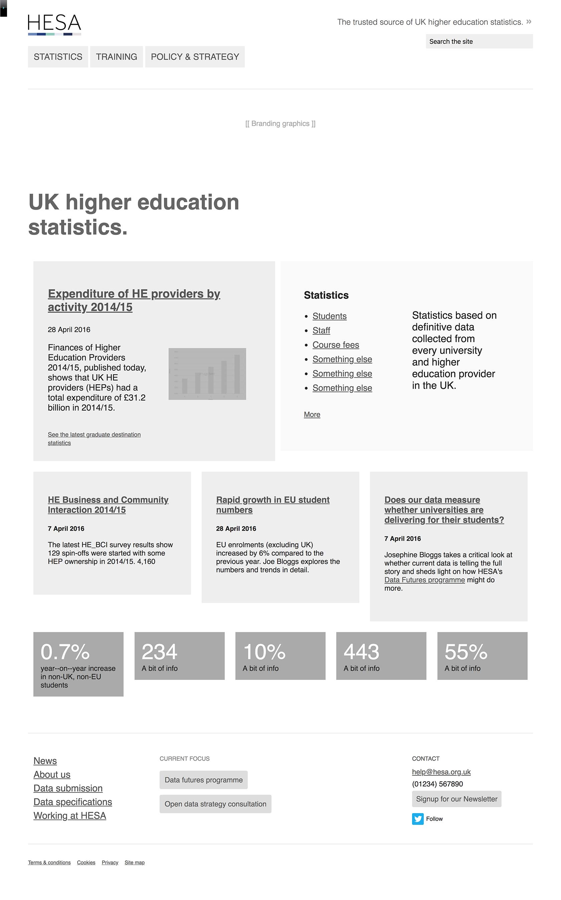
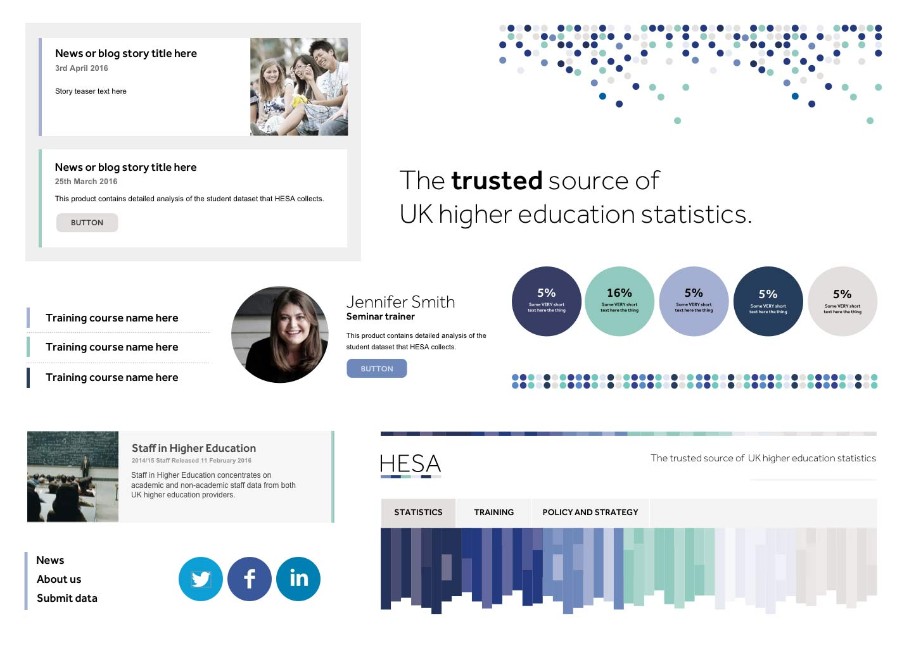
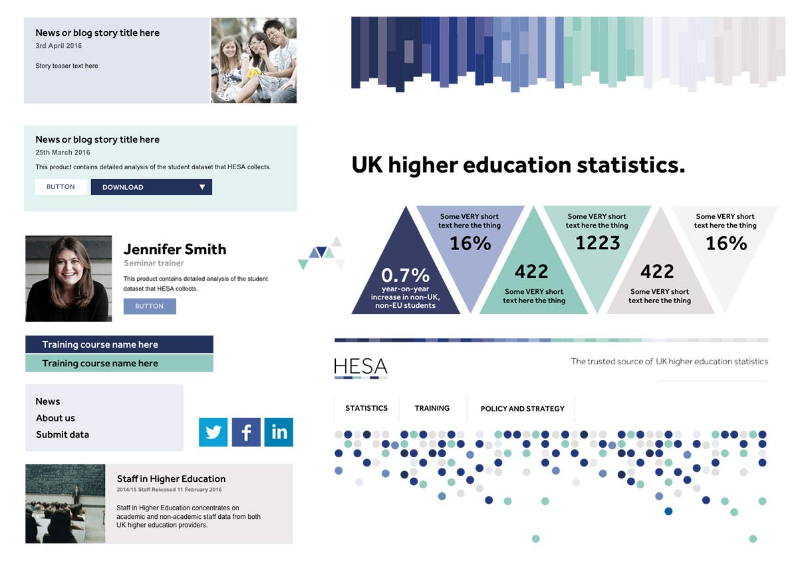
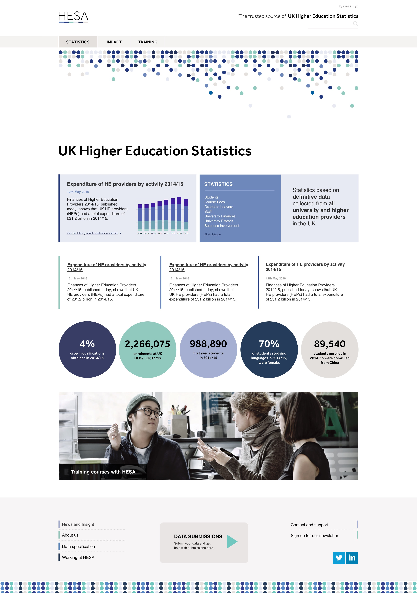
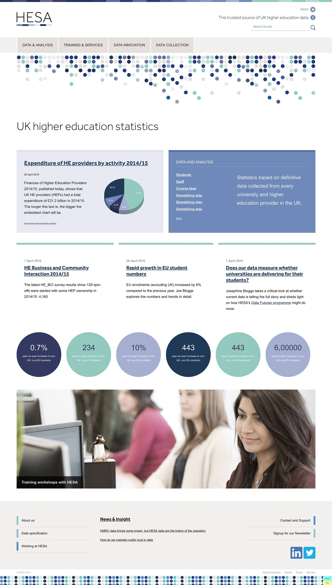
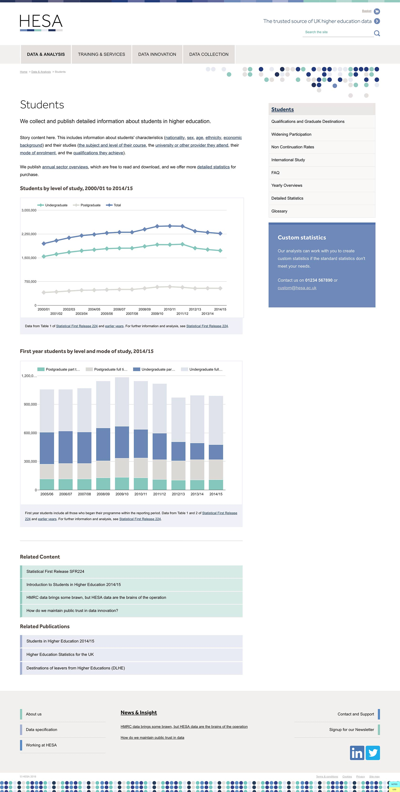
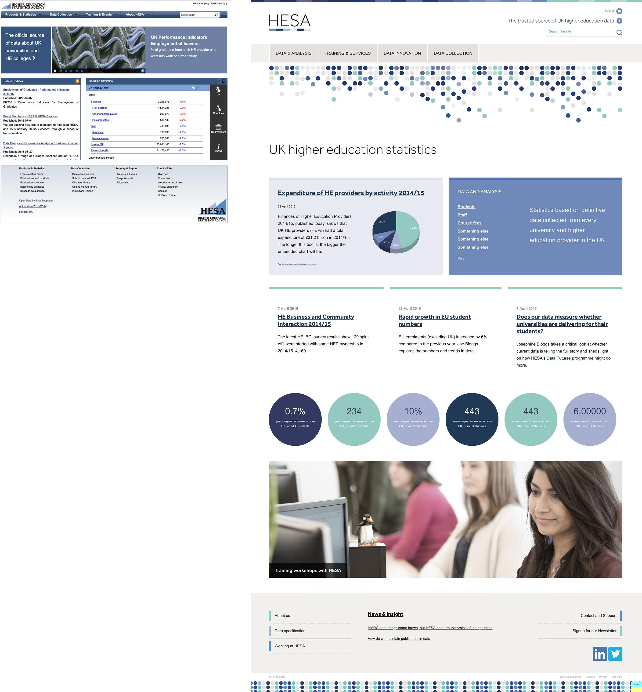

<a href="http://www.hesa.ac.uk">HESA</a> is the official source of data about UK universities and HE colleges.

===

### The Challenge

The main challenge with HESA was understanding their products, services and offerings and translating them into a meaningful Information Architecture and taxonomy.  The existing site was very confused, and lacked the prioritisation to understand what the most important tasks of the site were.

A kickoff workshop was held to work through some of these aspects and to understand the new brand which had been created by a third party branding agency.  Then the main challenge became how to display some of their complex products and variants, which lacked tangibility to the lay person, but would be understandable to those Higher Education statisticians who sought their data sets.

Visually, the challenge was to translate the graphical aspects of the brand to create a bold, distinctive look and feel and use the graphic motifs in a way to compensate for the lack of imagery available for statistical products & services, and related information sources.

### Design Process

* Kickoff workshop at the client offices
* HTML Wireframe prototype to explore IA, and landing pages
* Moodboards to interpret new branding
* Static mockups to visualise site look and feel
* HTML/CSS Designs to create a high fidelity prototype

#### - HTML Wireframe prototype -

{.img-screenshot}
#### - Moodboard 1 -

{.img-screenshot}
#### - Moodboard 2 -

{.img-screenshot}
#### - Home page mockup -

{.img-screenshot}
#### - Final Home page -

{.img-screenshot}
#### - Content page -

{.img-screenshot .no-effect}
#### - The old and the new -
