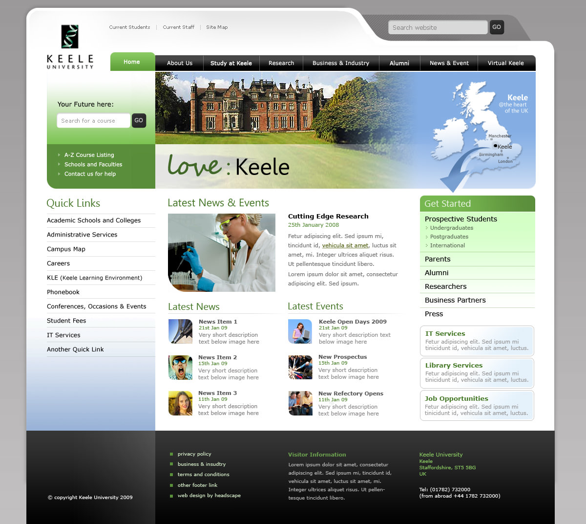
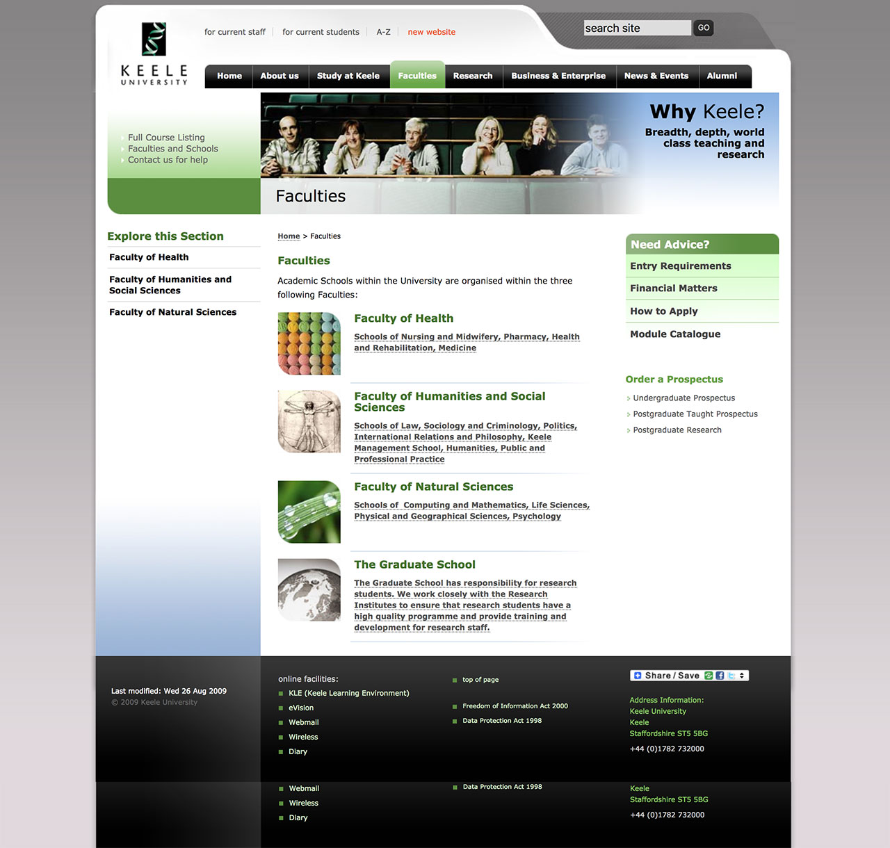
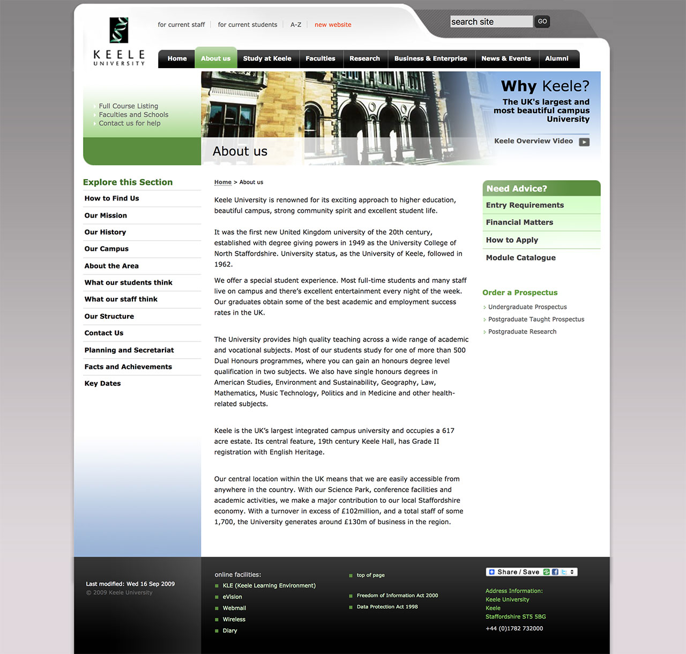

I redesigned the University of Keele web presence look and feel.   A lot of the work centred around devising a new Information Architecture.

===

{.img-screenshot}
#### - home page -

{.img-screenshot}
#### - landing page -

{.img-screenshot}
#### - content page -

