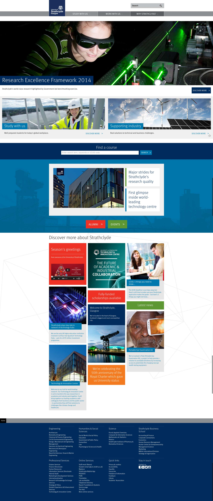

An agile resdesign of the University website.  Fast turnaround responsive design and development embedded in Glasgow with the Strathclyde web team. 

===

### The Challenge

Working fast and agile is a productive experience and the internal web team have worked hard to implement a modern, clean responsive design since.

### Design Work
* Wireframeing and prototyping
* Coding HTML/CSS/SCSS modularised coding
* Visual design and aesthetics
* Page template design

### Final Product

#### Department Home Page

#### Tabbed Course Course Content Page

#### Why Strathclyde Marketing Page

#### Home Page

<small>Home Page *Co-designed* with Strathclyde Web Team</small>