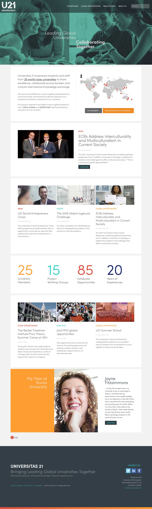
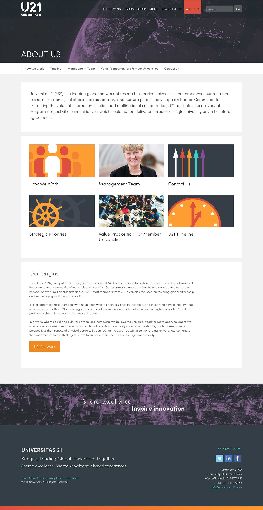
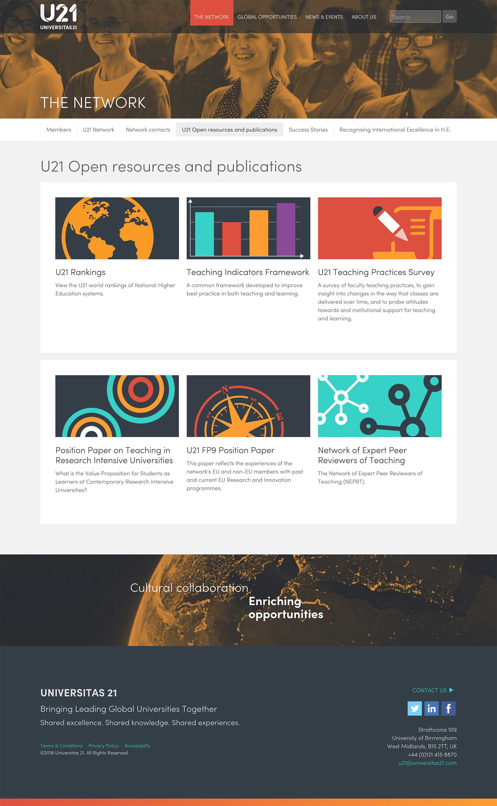
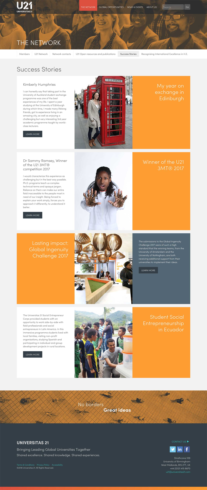

<blockquote>A strong, clear, re-representation of brand, IA, and content for a network of leading universities.</blockquote>

<a href="http://www.universitas21.com" target="_blank">U21</a> has 26 research-intensive university members, 1.3 million students, over 220,000 staff, budgets amounting to over US$25bn and an annual research grant income of over US$6.5bn.

===

### The Challenge

One of the biggest challenges of this project was understanding the function, roles and specific content types of U21.  A new brand was also being used for the first time and therefore it's application to digital was also being tested and any shortcomings addressed.

Another challenge, was trying to make some of the rather dry content more visually interesting, yet professional to a varied audience from students to University Chancellors.

### Design Work

* HTML wire-framing prototype
* Information architecture
* Static visual design and aesthetics
* HTML high fidelity prototype
* In browser page template designs:

{.img-screenshot}
#### - Home Page -

{.img-screenshot}
#### - About us -

{.img-screenshot}
#### - Library of branded pictograms used to enliven content -

{.img-screenshot}
#### - Success stories landing page -

