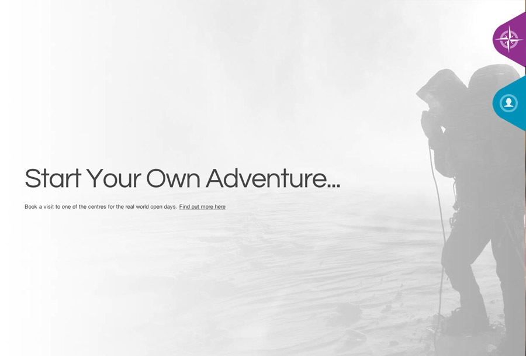
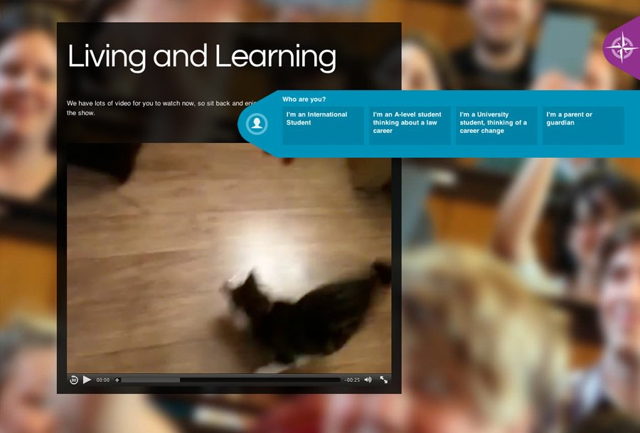

It's not often that I do speculative work for a pitch. But in the case of providing a Virtual Open Day that was 'not like a website' (what the brief asked for) I was really pleased to come up with the idea of using the current trend in parallax scrolling to create pages of great visual interest and interaction. I felt this could give students - especially International students, a great feel for what a college/town is really like, providing a great basis for video/audio/image carousels and panoramic views.

[**View the demo**](http://www.leighhowells.com/test/col)

