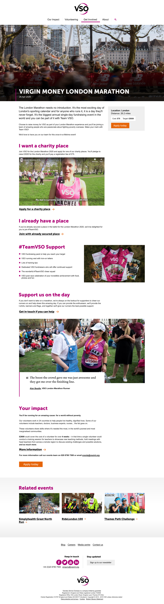
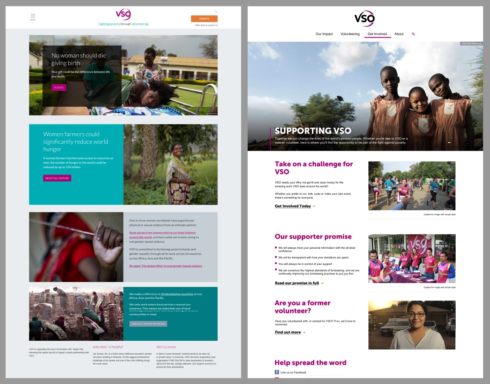
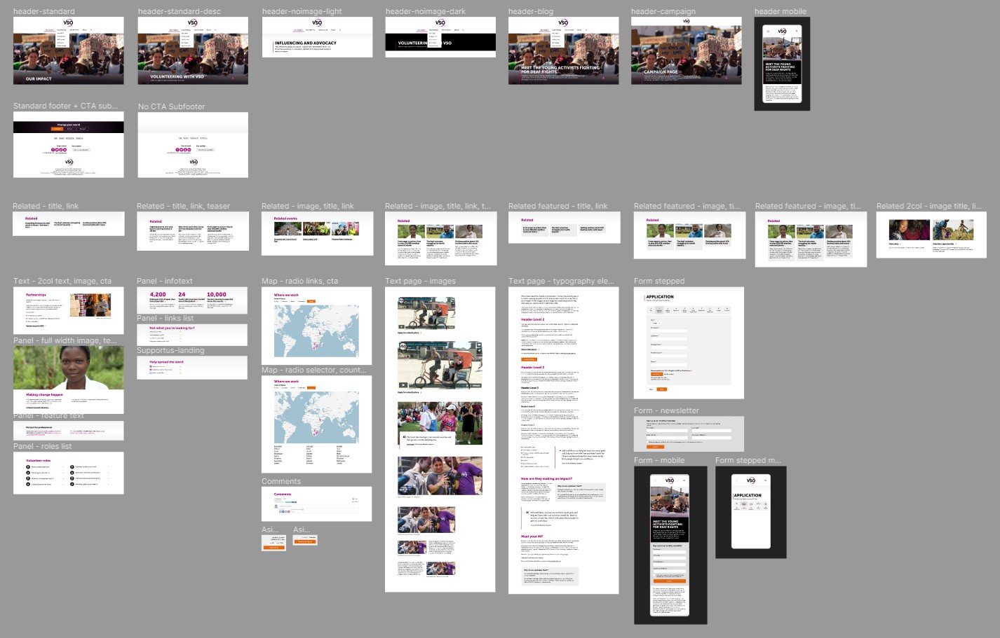

<blockquote>A simplification of a previous design, removing iterative in-house design changes and inconsistencies which had eroded the overall integrity of the site.</blockquote>

Voluntary Service Overseas (VSO) is a not-for-profit international development organization charity.  I first redesigned the VSO website in 2016 -  when the main objective was to improve the recruitment of highly skilled professionals for volunteering, simplify the navigation, and present a simpler, bolder, more confident aesthetic.

===

###New Objectives

The 2019 redesign set out to streamline some design patterns which had evolved and multiplied since 2016 leading to a bloated pattern library and numerous inconsistencies.   Many small, in-house design decisions had been made since 2016 leading to design elements that no longer worked together, colours clashed, and a lot of black had been overused leading to quite a dark and slightly ominous feel in places.

<small>The revised and simplified look, 2020.  Links clearly identified with underlining and arrows. Smaller arrow call to actions replacing proliferation of buttons to emphasise a hierarchy of tasks on the page.</small>

###Deliverables

* Design mockups of components
* Design mockups of key page types
* Art direction over build

###Design Challenges

One of the main challenges was to track down all the patterns which had evolved by doing a full audit across the site identifying where and why duplicates had appeared.  The subsequent challenge was to rationalise the duplicates to identify whether there were good reasons for their existence.

###Fixing Page Narratives

Since the 2016 design had launched, a lot of use had been made of coloured 50/50 image/text panels.  Whilst a pleasing occasional element, they had been overused so that whole pages had been built resulting in detached panels of content which were acting poorly with where a joined up message was important.  I redesigned these panels to be much simpler, removing the left/right alternating position instead allowing the text to read down a single left-hand column with less space separating and therefore potentially breaking the narrative flow of the page.

<small>LEFT:  The 2016 design featured lots of very visual panels  RIGHT:  In some ways, less  pretty  but the revised design helps keep the vertical flow of information, and prevents overuse of multi-coloured panels.</small>

###Design Library
Although the final pattern library was handed over using <a href="https://fractal.build/guide/">Fractal</a>, initial patterns were designed and presented with Figma. 

<small>Presenting the design library in Figma using multiple art-boards to assess simplification of patterns and variations</small>

