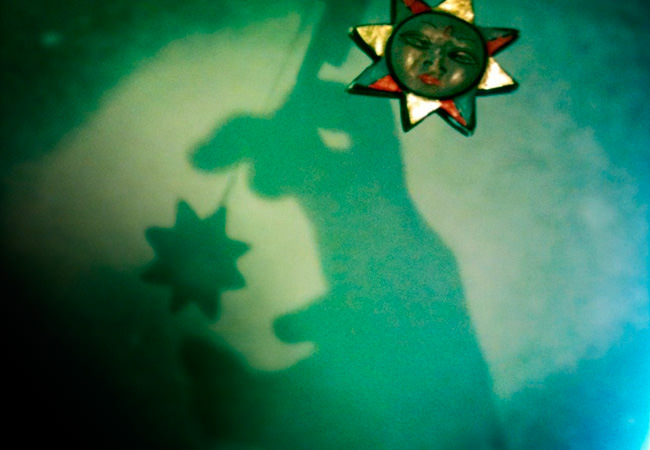

Written as a cinematic piece, the scene is slightly uneasy but mechanically timed giving an air of purpose and discovery within a mystery.  Subtle orchestral strings, french horn, oboe and orchestral percussion give texture whilst woodwind in the penultimate bars.

