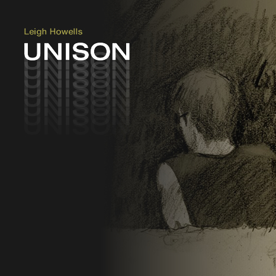

[embed title="Leigh Howells - Unison" ogg="http://www.leighhowells.com/audio/unison.mp3"]http://www.leighhowells.com/audio/unison.m4a[/embed]

A subtle synthy little tune, that tried hard not to become full-on trance, despite making use of some big trance resonant saw waveforms.  I held it back. I enjoyed the string sound a lot on this one, reminded my of Brian Eno's intro to The Johua Tree.

