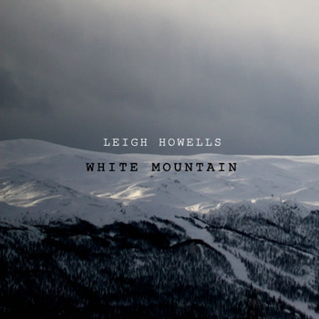

[embed title="Leigh Howells - White Mountain" ogg="http://www.leighhowells.com/audio/whitemountain.ogg"]http://www.leighhowells.com/audio/whitemountain.mp3[/embed]

I wrote this piece of music about 15 years ago when I was a music student at York.

It's still one of my favourite pieces and was technically fairly advanced (for me) considering what I had at my disposal at the time.  It was a 'thematic representation of the exhilaration of reaching the summit of a snow covered Himalayan peak' according to my nonsensical pretentious write-up at the time.

This was during the good times; the age of the Atari 520ST, booting from a floppy disk etc.  The time of hardware samplers (with more floppy disks).  Before the PC came along and bamboozled me with its baffling and overwhelming array of sounds and infinite possibilities.  I used to dream of the audio and processing power that is possible today with even a budget laptop.

