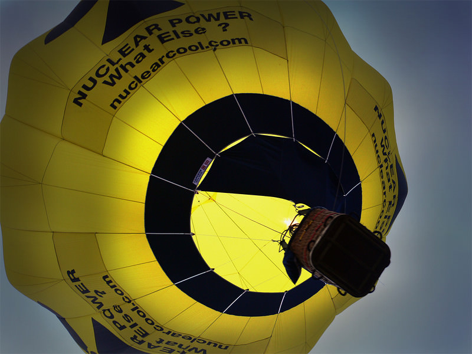

Today was the first day of the World Ballooning Championship.  Balloonists from around the world launched at 7am from Pidley Golf course about5 miles away.   So our day started by being woken by the sound of gas burners as 21 hot air balloons drifted slowly across Bluntisham.

===

I had planned to get up at 5am and go and watch the launch.  But I forgot.  So we went to the end of the race instead.  When we arrived there were about 10 ballons several miles away and they just weren't moving.  I guess if the wind drops then you go nowhere, and these balloons simply weren't moving.

Eventually, however, they did arrive, some adopting the strategy of dropping down low and skimming the fields, some coming straight down to the target from 1000ft.   The target was a large white cross marked on the 18th hole of the gold course, and each balloonist had to drop a marker flag as close to the centre of the cross as possible.  I'm still not sure whether this is the way you win a balloon race, or whether it's a combination of speed and proximity to the target.  Seems a bit strange if you come in last but still win by dropping your flag on the centre of the target.

]

Whatever the rules, as all the balloons came down it was rather spectacular as the gas burners lit up the fading September light.
