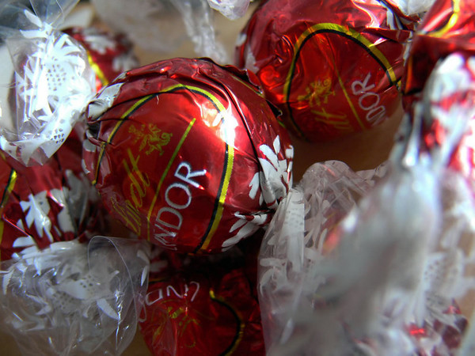

So, it's my birthday once again.  I made it to yet another 11th September.  Yes, it's become a notorious date in the calendar, but at least it's memorable now.

===

I'm sitting drinking an enormous cappuccino and eating Lindt Lindor Irresistibly Smooth milk chocolate truffles.   I'm alone in my office wondering why I'm even bothering to pretend to work today and pondering what a boring day of the week Tuesdays is.

I'm not normally very excited by my birthday, I've never liked being the centre of attention either at school, at work, even at home.  I think I've come to fear my birthday as it always becomes a day of introspection, self absorption, nostalgia, regret and fear.  It has become a day of reflection across the world marking the events of New York in 2001 and so it becomes a day of reflection and remembrance for me also.  It marks the passing of time, more sand being emptied from the egg timer of life, never knowing whether there is more in the upper chamber or the lower.

But of course, birthdays should be days of celebration and I will celebrate too.  In fact I am celebrating right now.  I celebrate having survived for this long, whereas others have not been so lucky.   I celebrate my health, my successes in the world, my achievements, all I have seen and all I have done, my family and I am thankful to all those I am fortunate enough to be loved by.  I can't complain about anything.  I have been so lucky in my life so far, nothing terrible has happened, nothing news worthy, my health has always been good, I haven't suffered any hardships.  I had a great childhood, I've enjoyed so much, it's all been a dream compared to so many lives.

Sometimes I feel I don't have all I feel I am entitled too, and things are unfair in the world.  But I know they're not really, I have exactly what I deserve, and I should be content with what I have and where I am.  All I have achieved in my life has been largely down to my own hard work, those things I haven't achieved are largely due to my own laziness - which probably means I wasn't really that bothered about them.  Those things that I still want in my life are still out there should I consider the energy required to obtain them is worth while.  Of course some things always seem to be beyond my reach, but for those things I should not be sad or bitter, I should learn to be thankful that I still have hopes and dreams.

I'm never going to get any younger, but today like every year I vow to try harder to look after my body and soul - just as soon as I've finished this box of chocolates.  Maybe I'll outlive all of the people who annoy me.  Maybe I'll go down in flames this very year. Who knows what tomorrow has in store for us all.

Of all things I am thankful for on my birthday I am thankful for being me.  I like who I am.  I like being me.  I feel well balanced, I feel I have a healthy outlook on the world and all it has to offer and I want to get out there and enjoy it all more and more.   I'm not perfect, but I even like my imperfections.  I enjoy so many different things in life now I could never get tired with this world.

Well, there is only one thing I would change in my life right now this September 11th.  The number of chocolates they put in this little box.  It's already empty.
