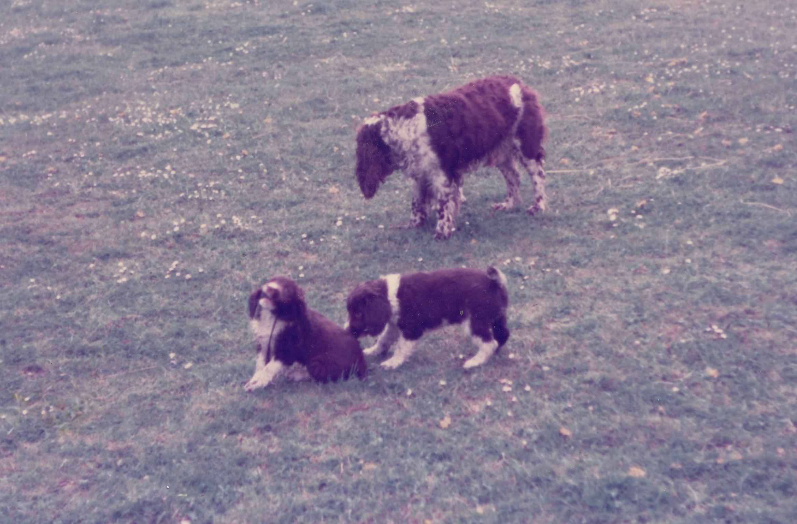

We got Bramble the Springer Spaniel when I was about 11.  She was the puppy of Shelly owned by Ann Shamma who lived at the end of our road called Frognall near Deeping St.James.  She was a beautiful puppy and a beautiful, pretty dog with lots of brown in her markings.

===

I remember vividly the day I carried her down the road as a puppy.  It was a hot day, with clear blue skies and bright sunshine and I held her like a baby against my chest with hear head peeping backwards over my shoulder.  Many years later I would remember this moment as I held my first child in the same way.

Bramble was mental.  She was a fruit cake.  Several sandwiches, a piece of pork pie and a flask of tea short of a picnic.   She was not only out of her tree, but several miles from the wood.

Of course she was never going to sleep in the house, this is what my father said.  So at first she lived outside in the shed.   She howled and barked for weeks.  So my dad gave in for fear of alienating the neighbours.  She also repeatedly threw herself at the shed door and would hurt herself sooner or later.

Next she stayed in the conservatory.  Again,  she howled and whimpered and barked all night long and threw herself at the door.

Within days she was in the kitchen.  I think you can imagine what happened in here.

She eventually made it to the foot of the stairs next.  Here she was happy.  Of course like most dogs she actually wanted to be in the same bed as my parents to be with the pack, but she seemed content to be close without a door separating them from her.

She never really learnt to be house trained.  Dad spent hours laying newspaper on the kitchen floor when we went out.  He spent even more time clearing it away again and disinfecting the floor once we returned.

Bramble had a couple of strange medical problems too, the most grotesque of which was some kind of vaginal/uterine prolapse, which meant half of her rear end appeared to hang out especially when she was in season.

As I said the main problem with her was she was crazy.  She would run round at full speed barking and weaving in and out of things for no apparent reason.  Her mad moments her plentiful.  She also had this strange smile she would use when visitors came to the house.  She bared all of her teeth and scared people when they entered the hallway as she did a strange wiggling dance from side to side, dribbling.

"She's just smiling at you,"  we would say to the worried looking guests.  I'm not sure they were convinced sometimes.

She wasn't old when she died, only about 9 or so. Springer spaniels are known for their extreme excitement levels, and maybe this is what finally exhausts them at a young age.

Yes, I was sad.  But, I vowed I would never, ever get a springer.  So far, so good.
