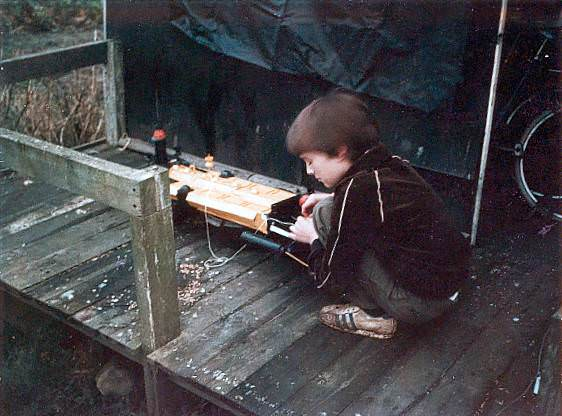
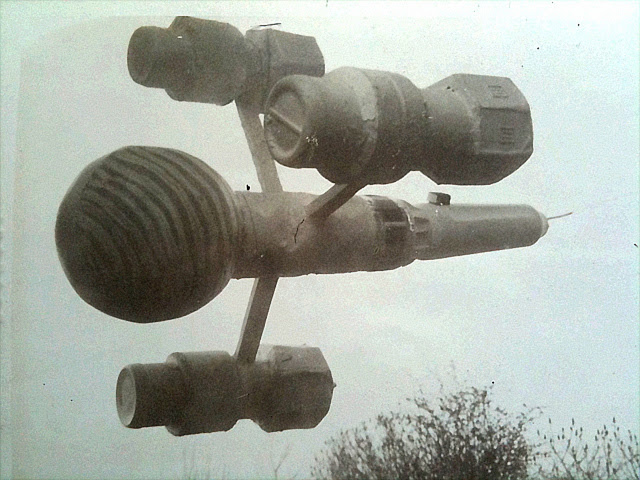

When I was little I was obsessed with making spaceships.  I would use anything I could get my hands on to create my masterpieces and spent all my time thinking what I might needed for the next section.

===

#### - Painting the Cygnus -

My main projects were the Liberator from Blakes' 7 and the Cygnus from Walt Disney's The Black Hole.

The photo above shows me putting the finishing touches to my Cygnus model on the veranda of the Wendy House that my father built at the bottom of the garden.  The structure in its turn became a bike shed and then the site of a much larger shed that Dad used as the base of his house plaque business for many years.

I think this model was mainly held together with tons of Humbrol's yellow enamel paint, which lay thickly over a base of cereal packets, toilet rolls and random pieces of plastic that my Dad brought back from work.  I seem to remember my main problem was that I had no photographs showing all of the
space ship from the film, and as I read the book first it took ages for me to actually see the film to get a better idea of how things were meant to be.   I loved The Black Hole at the time, everything about it.  As an adult I am horrified at just how terrible the Disney flop really is, and how I couldn't see this as an 8 year old.

I still have this model.  It's dusty now and broken into a couple of pieces.  In some ways it's a testament of my patience and creativity, and the dreams of a small child to recreate what his imagination was gripped by in one moment in time.  But often I look at it and the disappointment returns from when I was little, how much I failed to recreate the glowing jewel of engineering that I saw in the photographs from the film.  I always wanted it to light up, rather than being painted yellow.   I wanted it to be a perfect recreation of what I was intrigued by.   But it never was.

#### - My 'Liberator' model, from Blake's 7 -

