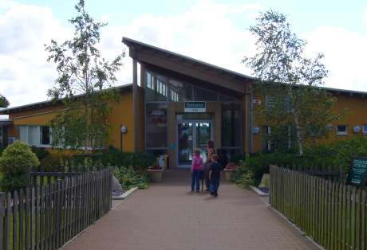

Ever since moving to Bluntisham in 2001, I have tried my hardest to keep my away from visiting Wood Green Animal Shelter. Wood Green, based near Godmanchester in Huntingdon is a rehoming centre for dogs, cats and all sorts of rabbits, rodents and assorted reptiles. In fact, if there is a creature
 in need of a home, it will probably end up at Wood Green.

===

I knew the day we visited Wood Green we would not be returning without a creature of some size, shape or colour. So for 6 years, I ensured there was always something better be doing should the suggestion of a trip be voiced. In the end, however, the circumstances of my Wife's first visit were beyond my control.

She eventually visited Wood Green as part of a school visit, for a sixth form careers fair - as the centre also houses conference and exhibition facilities. Therefore, I was unable to prevent her, to keep her away. And so came the phonecall. 11am. Barely 2 hours from entering she had found a dog.

"NO".. I said without hesitation. "NO WAY".

And so I lie now in the garden with an enormous fawn coloured greyhound sleeping a matter of yards away. His name is Mikey. It could have been worse, it could have been 'Colin'. Although, I didn't want another dog at 11am 5 days ago, here he is.

Did I mention the fact that this dog is big? He would probably stand 160 cm, and he weighs 34kg. He is up to my waist as he walks. But, this greyhound, is as soft as a brush. A very soft brush. He settled in within 12 hours, and already acts like he has lived with us for months.
