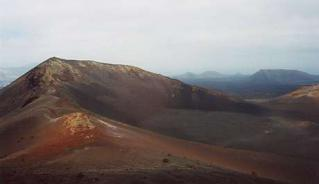

This year is the most non summer-like summer I can remember.   In fact I'm forced to ask myself 'does England actually experience seasons any longer?'.  Ok it's a bit colder in the winter generally, but it's hardly a massive contrast.

===

For the last 6-7 weeks it just seems to have rained.   Any sunshine we do get lasts minutes rather than hours, and to be quite honest - I'm completely pissed off with it.  I am forced to spend so long indoors with work, that I expect in the summer to be able to get out and enjoy outdoor hobbies.  But the weather is so bad, it keeps us inside at the weekend,  and slowly but surely I'm going 'stir crazy'.

Being British, I am of course obsessed with the weather.  So I have been checking the forecast for Lanzarote every day, half expecting it to suddenly experience the worst summer in living memory etc.  Fortunately my pessimism has not been rewarded and it looks like we can expect pleasant rather than unbearable temperatures with plenty of sunshine.

Lanzarote doesn't look like it will be my favourite destination on the planet by any means.  I like lush vegetation, forests, mountains, rivers and lakes.  Ok, it's got mountains - well a volcano, but little else it seems.   It's purely about the sun this trip,  and maybe the odd Paella and Sangria.

If it rains, I will cry like a baby.
