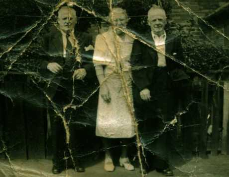
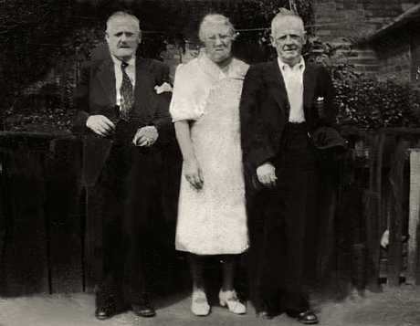

A few months ago my mum gave me a picture of my Great Grandmother and Great Grandfather (one on the right I think).   As you can see above, not exactly the most lovingly looked afer photo in the world.   I said I would have a go at making it better.   So after a few hours hard work in Photoshop tonight I've managed to restore it a bit.

This is the image after I cleaned it up:

Her face isn't so good as I had to imagine how half of it looked and sort of redraw it, but it generally looks much better now.   I will get it printed on photographic paper and add it to the other historical family portraits. Or maybe I will screw it up then cram it it under the fridge... like the last one.
