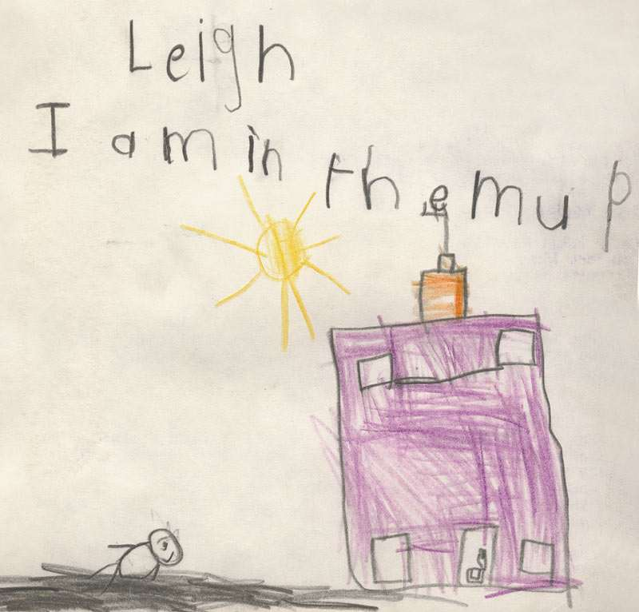

Magic Mountains (see previous post) reminded me that a few weekends ago, my Mum brought over a huge folder of school work from when I was between the age of 5 and 10 or so. One of my earliest pieces of written work is shown above. It made me laugh so much when I saw it.

===

I don't remember there being much mud near my house... which I don't remember looking like a lighthouse. I also don't remember being stuck in it.

Ahhh, ok. I need to re-interpret it on a higher level... (see previous post)

Clearly the work is symbolic of the human condition and the paradox that lies between the shining light of the sun and the endless mires through which humanity has to struggle during a lifetime. The mud can clearly be seen as representing hell, whilst the sun and the sky portray heaven and salvation.

Personally, I think it was simply a prophetic illustration of the endless shit I would find myself wading through for the rest of my life.
