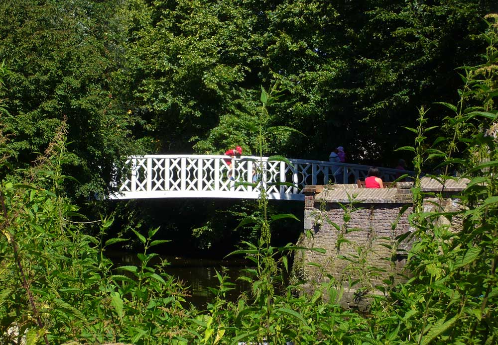
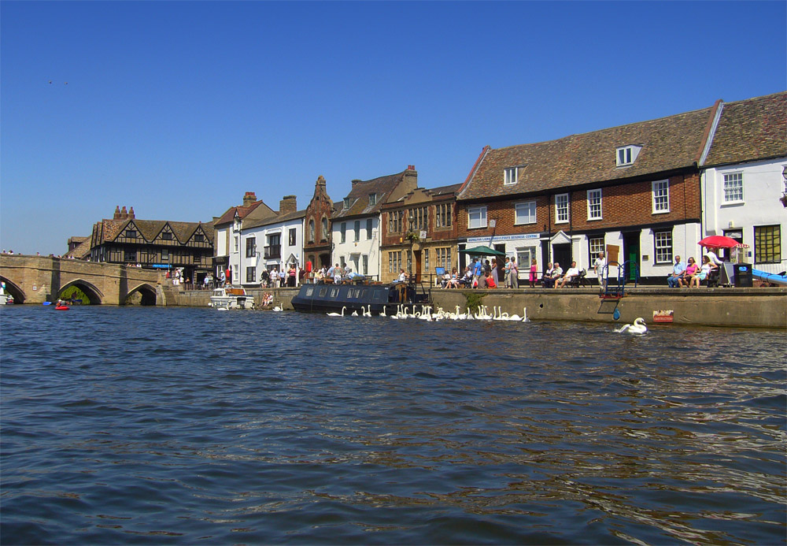
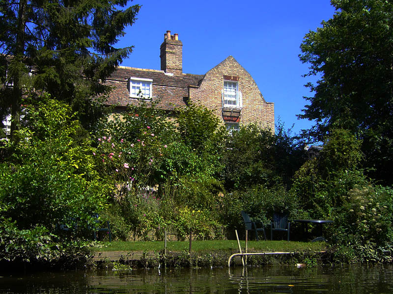
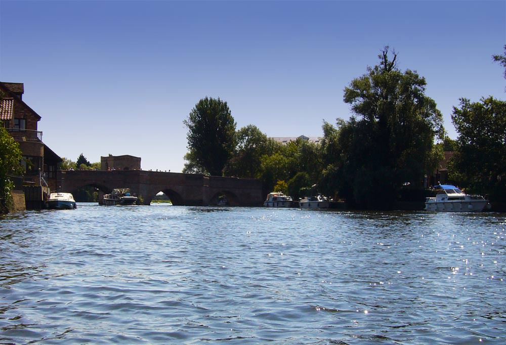
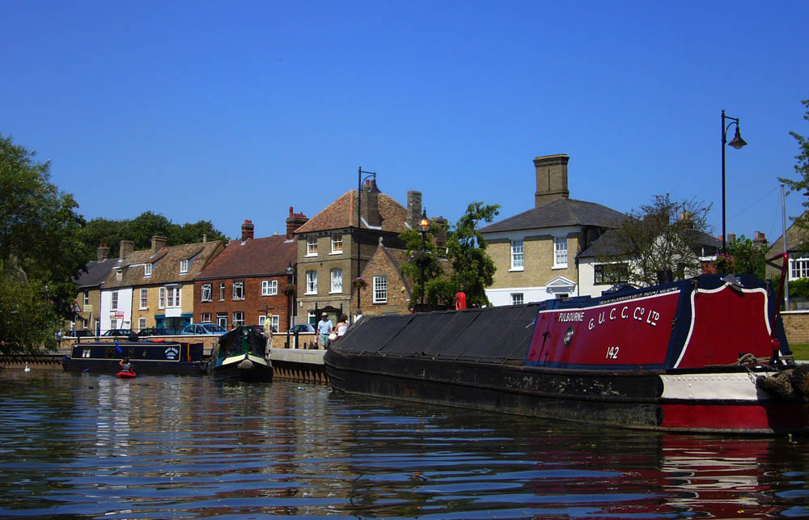
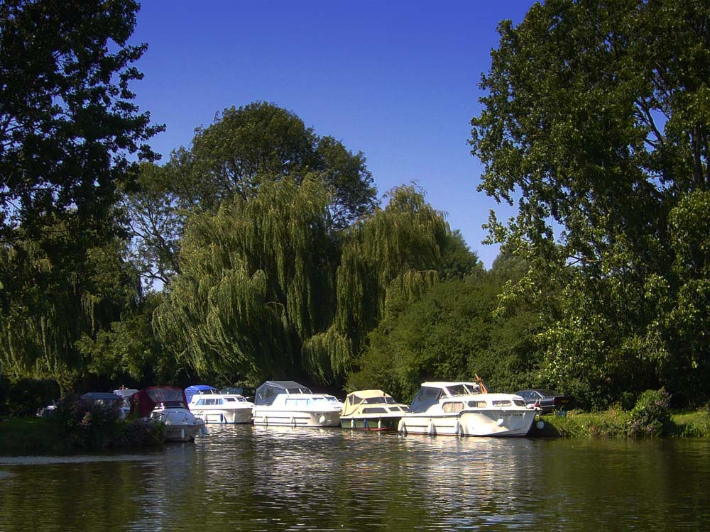

Occassionally this summer, the clouds have gone to bed and the sun has come out to play with it's best hat on. On those occasions it's time for action. It's time to get outside, and enjoy what little good weather we seem to be having this year.

===

I have been enjoying kayaking through St.Ives on these rare days as it's a wonderful experience. The usual route has been to start at All Saints Church where there is a 700 year old crossing point where the river splits around Holt Island Nature Reserve. The white wooden bridge (above) links the path by the Church here to the nature reserve.

Soon after paddling past the church on the left we pass the old vicarage with it's quaint English charms, backing onto the river with beautiful gardens.

A bit of paddling past the vicarage takes you along the Waites (above) where narrow boats moor along the newly developed quay area. There are always swans along this stretch and kids fishing. Best to paddle carefully so as not to upset either, they can both get nasty.

Shortly past the Waites you are out onto the main river (above) where it is wide and on a day like Sunday full of pleasure cruisers. The rowing centre is also here, and it's hard to avoid suddenly paddling much faster as you pass by as they are usually all watching from the river side.

Once under the medieval town bridge you paddle past the main town quay area where people sit eating ice cream, feed the swans and watch the boats pass by. This is the most beautiful part of our old town with small cafes and tudor buildings. It's a lovely place to sit on a sunny day, especially early in the morning before most people arrive.

Paddling away from the town quay and the bridge, the river widens past the new appartment blocks (shown above) before arriving at the meadows and the new town road bridge which bypasses the town.   This is where the kids are allowed to paddle for a bit, where there is less chance of ending up on the bank

Just the other side of the new road bridge you come upon Jones Boatyard and marina, a beautiful haven for cruisers and narrow boats. I wonder how many of these boats actually get out onto the river and how many provide a shadey beautiful and quiet place to sit and have a cup of tea on a sunny Sunday afternoon. One day I would like a cruiser, it would be an escape from home, maybe somewhere to go and work when home becomes to hectic and noisy.

Although I moan about England's weather,  it is so glorious sometimes.  Just occasionally there is nowhere I would rather be more.
