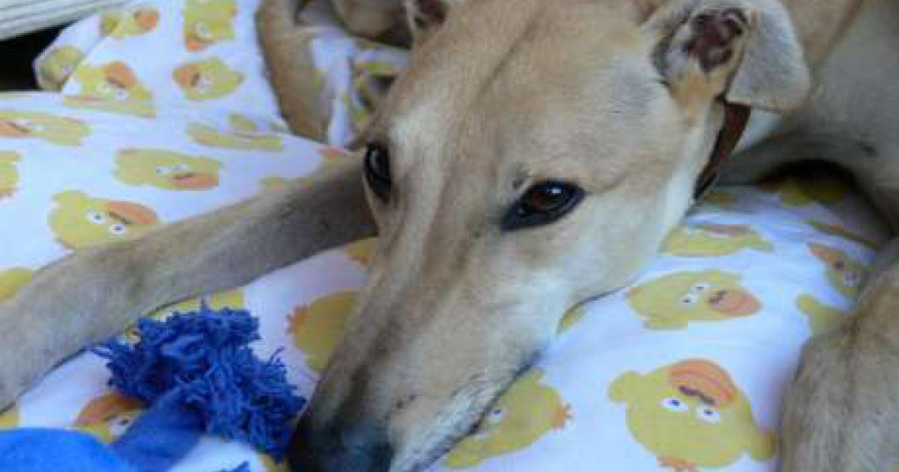

Every dog has his day. Mikey's day was today. We saved him from the Dog's Home

Considering I didn't want Mikey in the beginning I now admit that I like this hound.  He is big, gentle and incredibly affectionate.  With the kids his tolerance seems to know no bounds. Yes, life would be simpler without him, there would be less mess, less work, less walking, fewer problem going out for the day not to mention the extra expense etc.  But when all is said and done these animals bring humour, happiness and help a house become a home.
