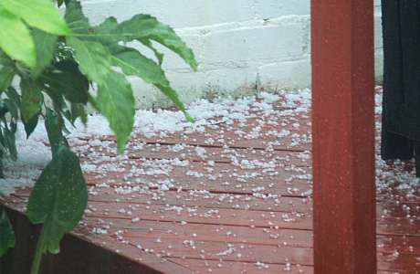

After four or five weeks of utterly terrible weather, what a relief to have a decent weekend. It’s July afterall. Finally, a pair of shorts. At last, sunglasses.

===

Over recent weeks I’ve been growing more and more desperate and depressed by the not-so-great British summer. We have had so much rain throughout June and early July it’s been demoralising.

Last week, July 3rd I believe we had a massive hailstorm. The skies were black, and the hail hard and heavy. Some of the hail survived like snow for several hours, and on their way back from school my children were able to gather the hail like snow and make small snowballs… or hail-balls.

So this weekend, with a new dog to keep calm and get used to his new family life, all we did was sit quietly in the sun reading, listening to music and trying our best to be accommodating to our new family pet.