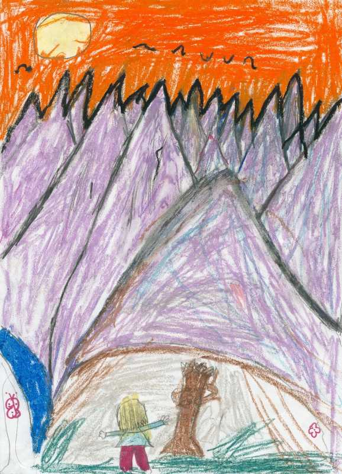

A few weeks ago my daughter  (now 7)  spent a while frantically drawing a picture in her room and presented it  it to me proudly in my office.  It's always nice to receive a picture, despite the fact it's usually drawn on the paper stolen from my printer.  What blew me away with this picture was the perspective and the figure in the foreground.

As with all art work, and I don't mean to sound pretentious here, it can be viewed on many levels.

Yes, sure, it's a kids picture of some mountains on one level with some funny looking mountains and a tree with a girl.  Looking at it on another level it could be seen as a metaphor for life as a grown up, endless uphill struggles as far as they eye can see.  We stand before the mountains and have to climb them all to get to the end where the sun is setting in a sky of fire.

Of course, she didn't really base her drawing on the human struggle... or did she?
