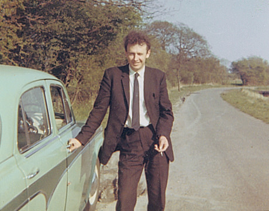

Now and then my  mum shows me a photo.  I'm usually completely horrified by how badly it has been looked after and incredibly ancient it looks.

===

I quickly scan these photos and do any small repair jobs that need doing to preserve these memories before they are lost forever more.

This photo is of my dad in the 60's I guess it must be, I need to find out more details.  He's looking pretty slim and has all the curly hair I've heard so much about.  I think my Mum wished I had inherited the tight curls of my father, but I didn't despite her best efforts to make me looks like an idiot.  My hair is generally slightly wavy, curls only start when my hair is about 6 inches long, which is more tired and distressed than curly.

I never wanted curly hair, I just wanted it to be straight.   I always hated  my hair as it has caused me so much grief, and even now it continues by receding and turning grey.  I try to ignore it mostly and pretend it's not there.  Which it won't be before much longer I'm sure.

Anyway dad looks cool in this photo, fag in one hand, motor in the other.  Not sure what he's doing down this country lane and who took the photo, but therein lies the mystery of photos from the past.
