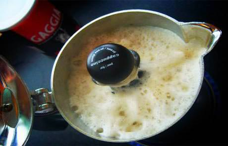
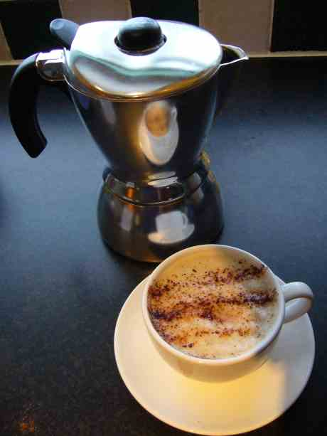

Early last year I paid about £130 for a Krupps espresso, cappuccino and filter coffee machine.   It was a brilliant buy at the time and I was delighted by the full range of coffee products I could produce with it.  Unfortunately it partly died.  I had been warned the the milk frothers on such machines tended to have very short lives and sure enough, just as the machine passed beyond it's 1 year warranty period, the milk frother stopped working completely. No more cappuccino/latte.

===

So for 6 months or more I have been having filter coffee, espresso with cold milk in, or just instant coffee. When my wife started to buy disgusting instant packet cappuccino sachets I knew it was time to sort something out.

I looked at the idea of buying a milk frother, but these are all for frothing up milk without heating it up.   I didn't want to buy another  machine and throw out a machine which was mostly perfect.  Then I came upon a stove-top pot which claimed to produce perfect cappuccino. the Mukka Express by Bialetti - the Italian coffee equipment manufacturer.

This pot is almost the same as my previous stove-top espresso pot.  However, it has a valve in the centre of the top half which builds up pressure, then releases forcing hot coffee and steam through the milk which is added to the upper chamber.  The result is a near perfect, consistently frothy and hot cappuccino, without any skill.  This compact pot design also means I can take it with me when I travel and can enjoy anywhere and everywhere.  Not so easy with an electrical appliance.

I'm so amazed by this product and it's results, I feel like buying everyone I know one.   Maybe it would make the perfect Christmas present.

Unfortunately I am now at risk of severe caffeine poisoning as I have had 4 cups of espresso/cappuccino today already.
