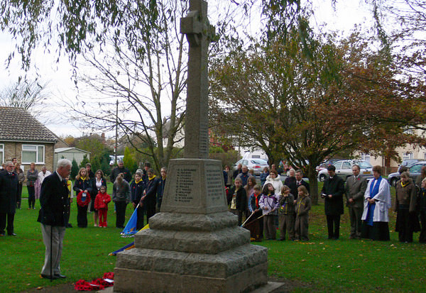
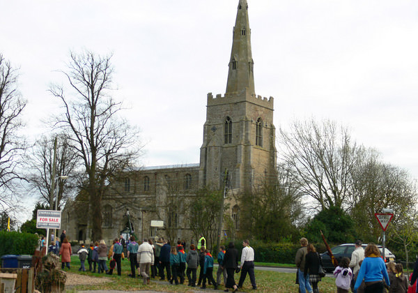
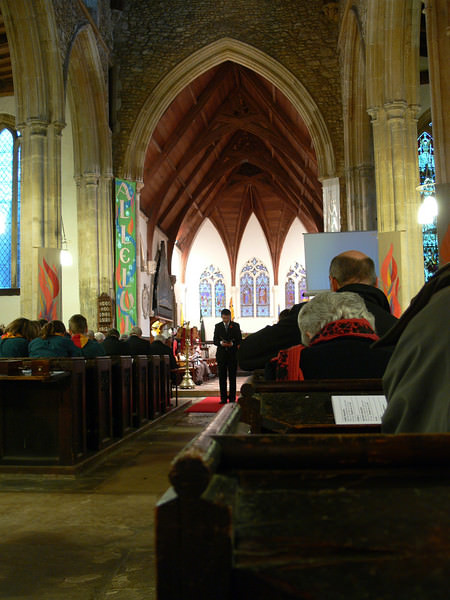

Yesterday was Remembrance Sunday when we remember all those that died in war throughout the 20th Century and continue to fight and die in Afghanistan and Iraq.  Eleah was in a parade to the Church for a memorial service with the Brownies and helped he friend Susie carry a flag.  Both Elisa's parents and my parents came with us as with the promise of a beef roast dinner afterwards.

We followed the Scouts and the Brownies as they carried their flags to the Church.   I was surprised to see quite a few old men in uniform wearing their medals with pride and hadn't realised the village had so many war survivors.

Despite living in Bluntisham for so many years, I had never been in the Anglican Church on the main road, St. Mary's.   Despite visiting so many Churches around the world I've not actually been to the one in my own village, and I was pleasantly surprised as it was quite beautiful.  Eleah and the other Brownies sat the front of the church during the service.  There was lots of very bad singing through some very slow hymns and the Last Post was played by three bugle players at the rear of the church.  The Last Post always sends a shiver down my spine, it's very emotive.

One thing that will stay with me is the fact that one of the soldiers said that people in Britain were more interested in X Factor than the were with the war in Iraq.  How very true. Once the service at the Memorial stone was over we walked back home in the freezing cold wind ready for our beef joint bought from the farm shop.
