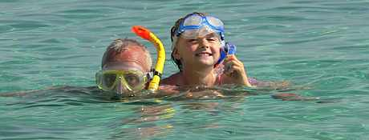

Yesterday I joined the masses of ten year old's on Playa Dorada beach and bought a snorkeling set.  I haven't tried to snorkel since I myself was about ten years old.  But to be honest I've never really felt the urge to.  Until 11am yesterday morning.

===

What made me consider it was time to resume my old seaside enjoyment was swimming in the sea with my regular goggles on. The waters here are crystal clear and I was amazed to see shoals of beautiful fish swimming amongst the bathers.  Ok so we're not talking about the great barrier reef here nor indeed your average coral reef, but nonetheless it was a pleasure to swim and see so much life so clearly. I have never swum in such clear, warm waters before and decided I should get into the spirit of the other kids in the sea and enjoy it too.

The basic snorkel set involves a good visibility mask which seals over the nose, with a pipe from the mouth to the surface.  This allows you to swim with your face in the water and still breathe through your mouth.  If you want to dive down simply take a sufficient gulp of air for the dive and at the end of the dive blow the water out of the tube back at the surface and continue.

All well and good as long as you keep calm and don't panic at the sound of your own breathing, which sounds like a Leviathan is chasing you.  If you panic you inevitably begin to hyperventilate and end up choking on a lungful of salt water.  Not nice.  As I discovered a couple of times yesterday.

I bought a second (cheap) set for the kids to share, and spent a while trying to teach them both the basic art at the beach. My son spent his whole time adjusting the mask, running to the water, adjusting his mask some more and then running off. My daughter was braver and less fussy about perfect mask calibration and at least put her head in the water. She seemed perplexed that I was spending so much time looking at sand, but failed to be convinced she should come further than a metre from the shore.

Today we have been practising in the swimming pool without the salt burning our eyes.  I think I have mastered diving down now and clearing the snorkel, but its not easy with my kids pretending I am a submarine. It would also be easier with a good pair of flippers.   Flippers, of course... durr, I knew I was missing something.

Tomorrow I think I will join the twelve year old's and get myself some flippers so I can look really stupid.
