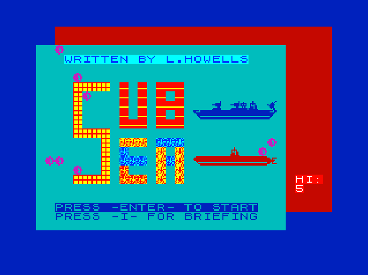

Just loaded a ZX Spectrum 'game' I made in 1984 - into the Fuse MacOS emulator.  Haven't seen Sub Sea for 28 years, and I think it demonstrates the pinnacle of my design efforts as a 15 year old. 
Some might say my improvement has been negligible since.  But I'm very impressed by the FLASH attribute on my 'typography'.  Make all the things Flash on and off I say!

===

If you'd like the Massive 12K TAP file (yeah, of course you do) [here it is.](/demo/spectrum/SUB_SEA.TAP)  Many thanks to Julian Goodchild's [Type Fantastic - Hall of Fame](http://www.users.globalnet.co.uk/~jg27paw4/type-ins/hallfame.htm) for keeping all this stuff for all these years!
