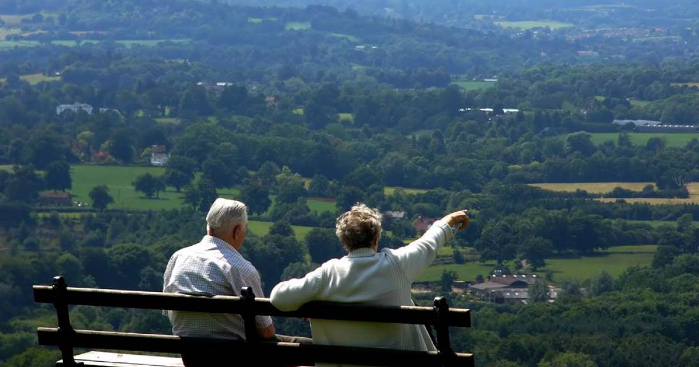
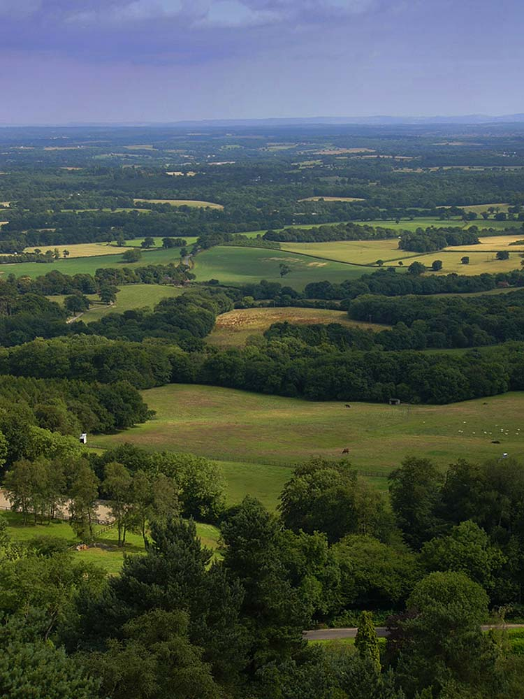
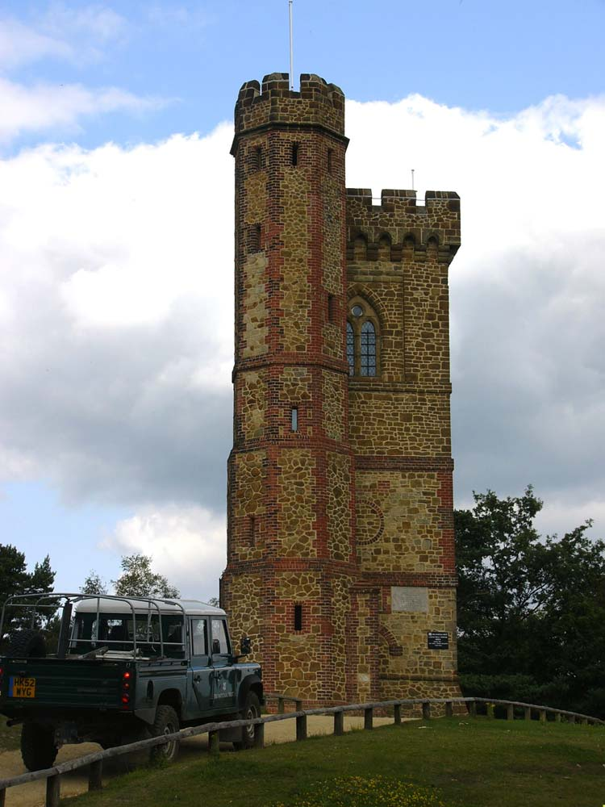
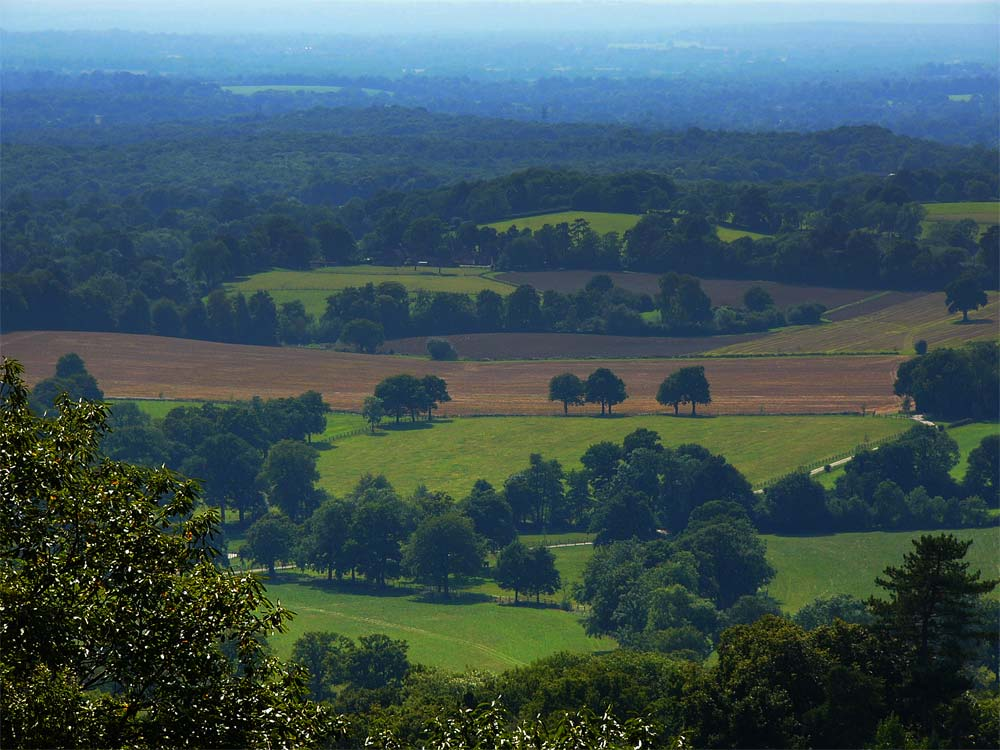

Occasionally I get the pleasure of leaving my office and travelling around the country on legitimate work missions.   Recently my mission was to take a series of photographs from hill tops in Surrey, create panorama images and shoot some video footage.

===

I spent a couple of days wandering around steep hill sides, sometimes lost, often exhausted trying to find the best view points to see across the valleys below.   We aren't talking alpine vistas here, but even I was surprised at some of the huge views that could be seen from the top of modest looking lumps in the landscape.

At Leith Hill (below) I was let into the tower built at it's summit by the ranger, this gave even greater vision across the surrounding countryside in all directions.  I could even see the new Wembley stadium which is around 30 miles away to the North.

From the photos I made several 360 degree panoramas with hots-pots for the Surrey Hills website and a short video.  The video was especially fun to create as it featured a voice-over from Penelope Keith which my colleague recorded at her home.

Although this country and it's weather drives me insane on times, looking at these photos reminds me just what a green and pleasant place it really is.
