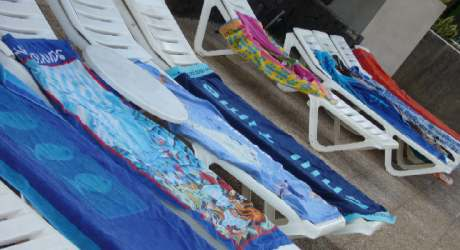

It is a standing and almost institutionalised joke that the Germanic race are first to the pool laying towels on sunbeds in order to reserve their places.
  
===

  
Here in the Sun Royal Apartments, Playa Blanca in Lanzarote there are no Germans at all.  Not one. They are all in the sister complex next door.  Yet the phenomena of empty sunbeds adorned with dry towels persists from 7.30am.
  
It's my newly acquired belief that we simply use the German people as scapegoats for our own anxieties at the poolside.  We are of course fearful of not getting space by the pool, yet we are too disorganised, too polite and too self conscious to be as blazon to get our towels down before this highly organised race of people.  We simply hate the fact that they have the audacity to beat us in this sun-fuelled competition and so the joke proliferates.

In a situation where there are only English and Spanish people in a hotel it appears that exactly the same thing happens.  As I sit writing this by the pool at 9.30am there are around 35 sunbeds with unoccupied towels despite the fact each bed has a prominent sign on it saying 'it is forbidden to reserve this sun bed'. One or two of these are Spanish, but the majority are English, all desperate to ensue they have their fair allocation of pool-side fun.

As an aside, it's 39 degrees in the shade here this morning already and blowing the hottest Saharan wind I've ever felt.  It's as though someone has a fan heater on us all and it's switched to setting II. (by 12.30pm it was 42degrees C).
  
We all hate to miss out of course.  We all hate to be stuck with the leftovers.  The same spirit that sees customers running across the tarmac to our economy flight to get window seats or the seat nearest the doors, brings out the worst in us at the poolside too.  It's the spirit of competition that fuels capitalism and the meritocracy of our nation, yet sometimes it pushes us to puerile selfishness and greed.

Yes. We have joined in too.  With the flaky justification of 'if you can't beat them join them' we have sent the kids down with towels to reserve beds.  Maybe this is the real secret of the German people, they have their children more highly trained than our own.
