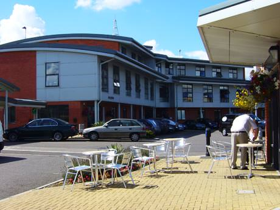
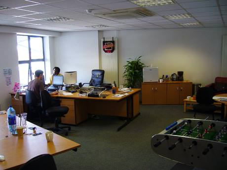
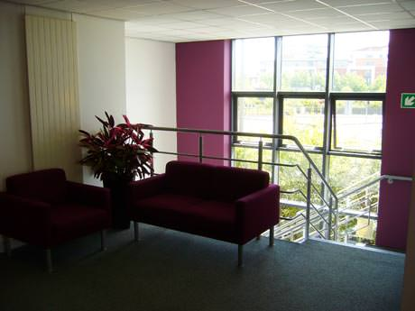
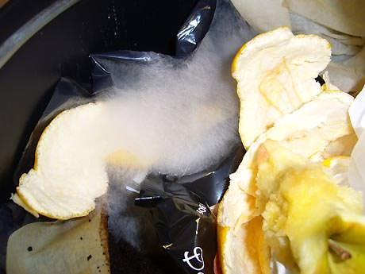

Occasionally I need to make a very long and boring trip down to the Southampton office for meetings and our fabulous monthly ’show and tell’. We have a single large room in a Basepoint centre (above) which provides all the facilities a small business needs, but mainly a good office environment and an address.

It seems I will now need to make more trips to Basepoint as we are trying to become less fragmented even though we work across the country. It’s not going to be easy with kids and dogs etc but we will see. If it didn’t take 3 hours to get down here it would be great. I like all the guys in the  company and if I don’t go for a while it feels strange and I feel alienated from them.

The development team work full time from the office where they have all the technical systems set up for collaborative working. Steeve, Rob, Mike and Dave. They now also have a table football game, a fridge and plants.

The genereal environment is very professional and plush, it’s nicely decorated and feels like a positive place to come to work. Strangely all the signs in the building are given in Polish as the building seems to be half occupied by small Polish businesses. Infact I am lead to believe that more than 1 in 10 people in Southampton is now Polish - somewhere between 10,000 and 30,000 people - but nobody knows the exact figure. From those few I know and have met, I like them a lot. Not sure everyone feels the same in the city though.

Unfortunately, this office is inhabited by men. Young men. We don’t pay for the cleaning service and so it is left to the guys to clear the place up and keep it clean. This of course means there is stuff all over the place and the bin never gets emptied. Once I managed to actually prise the bin open yesterday I found all sorts of new lifeforms emerging from the dark, dank interior.

