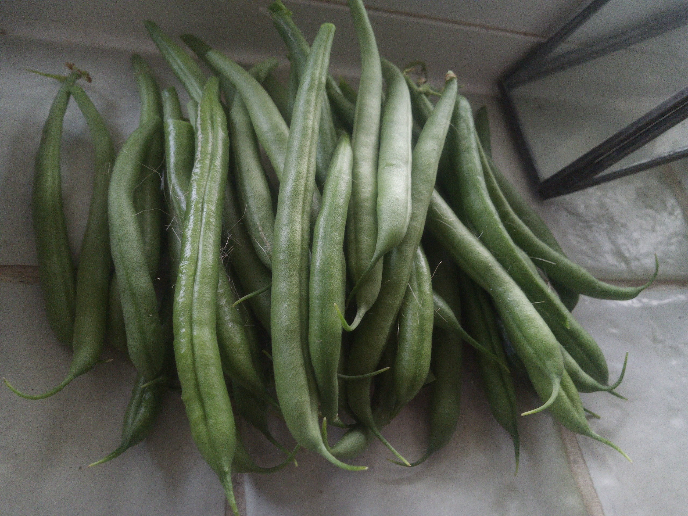

So I have actually managed to grow FOOD.  Not a lot of food it has to be said.  But it's food none-the-les.

I also managed to keep a chilli plant alive to grow actual red chillis too.  Now not really sure what to do with them all.

<em>I didn't realise the beans had actually grown as they were hiding - so a nice surprise.</em>

