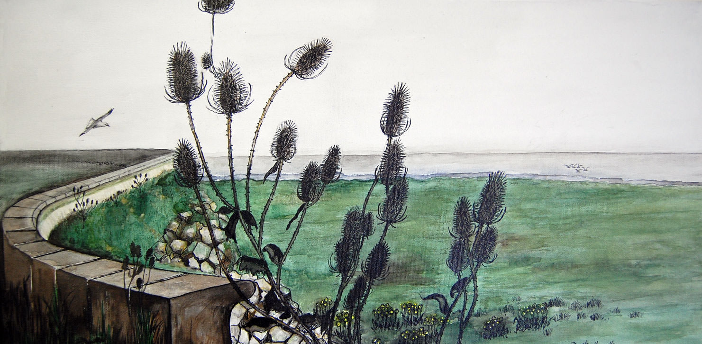

===

The protective sea wall near Nash, Newport, Gwent - protecting the coast line and salt marsh of the Severn.

Part of a series depicting the wetlands flora and fauna around the Severn Estuary, near Nash, Newport.  Acrylics on canvas with pen 2008.

